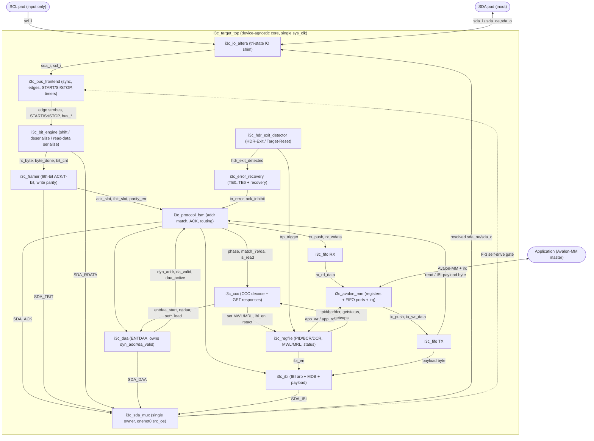

# Formally Verified I3C Target (Endpoint) for FPGAs

A device-agnostic SystemVerilog implementation of a **MIPI I3C Basic v1.2 Target**
(SDR mode + In-Band Interrupt), with an **Avalon-MM** application interface. The
Target never drives SCL; it oversamples the SDA/SCL lines on a single free-running
`sys_clk` and acts on detected bus edges. Every internal SDA driver feeds one
**single-owner mux** (`i3c_sda_mux`), so the device can never contend with the
Controller. The whole core is vendor-neutral — the *only* device-specific file is a
thin Altera tri-state IO shim (`rtl/altera/i3c_io_altera.sv`).

The design is checked **three independent ways**:

| Method | Tool | Result |
|---|---|---|
| **Formal** | yosys 0.66 + SymbiYosys + boolector | **ALL GREEN** — 14 configs, 41 proof tasks (BMC + k-induction + cover), ~280 assertions |
| **Simulation** | Icarus Verilog (controller BFM + Avalon master) | **21 / 21 PASS** — broadcast ACK, full ENTDAA, private write/read, GETSTATUS |
| **Synthesis / STA** | Altera Quartus Prime Pro 25.3, Cyclone 10 GX | **Internal logic meets 125 MHz** (reg-to-reg +2.15 ns, Fmax ≈ 244 MHz); `avs_readdata` is registered (2-cycle read); the one residual output path is the required-combinational `avs_waitrequest` (−1.81 ns), pad-buffer-limited only in standalone pin synthesis — see [`syn/altera/README.md`](syn/altera/README.md). 528 ALMs / 348 regs / 2 RAM blocks |

---

## Features

- **SDR Target (endpoint)** — bus-condition detection (START / Repeated-START / STOP),
  byte framing with the 9th ACK/T-bit, private write and private read.
- **In-Band Interrupt (IBI)** — open-drain arbitration on `{dyn_addr, 1}`, push-pull
  Mandatory Data Byte + optional payload, arbitration-loss back-off, NACK/defer handling.
- **Dynamic address assignment** — **ENTDAA** (mandatory) with per-bit arbitration over
  `{PID[47:0], BCR, DCR}`; optional SETDASA / SETAASA (via `STATIC_ADDR_EN`) and SETNEWDA;
  RSTDAA clears the Dynamic Address.
- **Required CCCs** — ENEC/DISEC, RSTDAA, ENTDAA, SET/GET MWL, SET/GET MRL, SETDASA,
  SETNEWDA, GETPID, GETBCR, GETDCR, **GETSTATUS** (always answerable), GETCAPS (Format 1),
  RSTACT; ENTHDRx quiesces the core; ignore-class CCCs (ENTTM / ENTASx / DEFTGTS /
  SETBUSCON) are consumed without error; unsupported/deprecated Direct CCCs are NACKed.
- **Error detection & recovery** — TE0..TE6 detection with discard-to-STOP/Sr and
  HDR-Exit / Target-Reset-Pattern recovery; sticky `proto_err` (read-to-clear via GETSTATUS).
- **Avalon-MM application interface** — 32-bit register map, RX/TX FIFOs, level-sensitive
  `irq`; Avalon clock defaults to `sys_clk` (no CDC) or can run async with Gray-pointer FIFOs.
- **Device-agnostic core + swappable IO shim** — all RTL is vendor-neutral except the
  Altera tri-state SDA pad wrapper; the formal harness replaces the pad with an abstract
  wired-AND bus so contention is observable.

---

## Top-level datapath

`i3c_target_top` wires the frozen netlist below: physical pads feed
`i3c_io_altera → i3c_bus_frontend → i3c_bit_engine → i3c_framer → i3c_protocol_fsm`,
which routes to `i3c_ccc` / `i3c_daa` / `i3c_ibi`, the register file and the RX/TX FIFOs,
out through `i3c_avalon_mm` to the application. Every SDA drive source funnels through the
single-owner `i3c_sda_mux`, whose resolved `sda_oe`/`sda_o` drive the pad and gate the
front-end's bus-condition detector (the F-3 self-drive gate).



---

## Repository layout

| Path | Contents |
|---|---|
| `rtl/` | Device-agnostic SystemVerilog core (15 modules: `i3c_pkg`, `i3c_sda_mux`, `i3c_bus_frontend`, `i3c_bit_engine`, `i3c_framer`, `i3c_hdr_exit_detector`, `i3c_fifo`, `i3c_protocol_fsm`, `i3c_daa`, `i3c_ccc`, `i3c_ibi`, `i3c_error_recovery`, `i3c_regfile`, `i3c_avalon_mm`, `i3c_target_top`) |
| `rtl/altera/` | The only vendor-specific file — `i3c_io_altera.sv` (thin tri-state SDA pad shim) |
| `formal/` | SymbiYosys `.sby` configs + `run.sh`; one workdir per proof task (`*_bmc` / `*_prove` / `*_cover`) |
| `sim/` | Icarus testbench `tb_i3c_target.sv` (controller BFM + Avalon master) + `run.sh` |
| `syn/altera/` | Quartus project (`i3c_target.qsf`), timing constraints (`i3c_target.sdc`), `build.sh` |
| `docs/` | `architecture.md` (block + register map + formal plan), `requirements.md`, `interfaces.md`, `design_decisions.md`, `diagrams.md`, `verification_status.md`, plus `critique.md` / `open_questions.md` / `assume_ledger.md` |

---

## Quickstart

```bash
# 1) Formal — full SymbiYosys suite (ALL GREEN)
source tools/env.sh          # puts yosys / SymbiYosys / boolector on PATH
cd formal && ./run.sh        # or ./run.sh i3c_ccc to prove a single module

# 2) Simulation — Icarus controller-BFM testbench (21/21 PASS)
./sim/run.sh                 # compiles with iverilog -g2012, prints the PASS/FAIL tally

# 3) Altera synthesis + place&route + STA (Quartus Prime Pro 25.3)
./syn/altera/build.sh all    # or 'syn' for an analysis-&-synthesis-only check
```

`formal/run.sh` runs every `.sby` and prints a per-task PASS/FAIL table ending in
`ALL GREEN`. `syn/altera/build.sh` stages the RTL on the Windows side and drives Quartus
(`quartus_syn` → `quartus_fit` → `quartus_sta`); see `syn/altera/README.md` for the device
and toolchain paths.

---

## Verification summary

| Method | What it covers | Headline |
|---|---|---|
| **Formal** (yosys 0.66 + SymbiYosys + boolector) | Per-module + integration safety/correctness invariants: contention-freedom (F-1), single-owner SDA `$onehot0` (F-2), self-drive gate (F-3), ACK/NACK correctness, T-bit/parity, address matching, ENTDAA, CCC decode, IBI gating, error recovery, Avalon-MM compliance | **ALL GREEN** — 14 configs (13 modules + integration), 41 tasks, ~280 assertions |
| **Simulation** (Icarus, controller BFM + Avalon master) | Real end-to-end transactions on an oversampled open-drain bus: broadcast `0x7E` ACK, full ENTDAA (DA latches `0x08`), private write (`0x5C` → RX FIFO), private read (`0xC3`), GETSTATUS ACK + response | **21 / 21 PASS** |
| **Synthesis / STA** (Quartus Prime Pro 25.3, Cyclone 10 GX `10CX220YF780E5G`) | Real synthesizability, place & route, static timing | **Internal logic meets 125 MHz** (reg-to-reg +2.15 ns, Fmax ≈ 244 MHz); `avs_readdata` is registered (2-cycle read); the one residual output path is the required-combinational `avs_waitrequest` (−1.81 ns), pad-buffer-limited only in standalone pin synthesis — see [`syn/altera/README.md`](syn/altera/README.md). 528 ALMs / 348 regs / 2 RAM blocks |

The per-module formal proofs use an **idealized one-cycle edge model** (one strobe = one
settled bus edge). Simulation, with real oversampled timing, therefore found **8 integration
bugs the formal proofs could not see** — **7 are fixed and re-verified** (formal still ALL
GREEN, Quartus build still clean) and **1 is tracked**:

1. **Fixed** — GETCAPS/RESET reads returned 0: a 4-bit `app_*_idx` aliased register indices
   16/17 to 0. Widened `app_wr_idx`/`app_rd_idx` to 5-bit across `i3c_regfile` /
   `i3c_avalon_mm` / top + added CAPS/RESET read decode.
2. **Fixed** (FINDING-SIM-1) — a driven SDA slot released while synced-SCL was still high,
   which the front-end read as a false STOP. Added front-end release-tail `OE_TAIL` so
   bus-condition detection stays gated a few cycles after `sda_oe` deasserts.
3. **Fixed** (FINDING-SIM-2) — `flush_tx`/`flush_rx` generated by Avalon but unwired. Added a
   synchronous `clear` port to `i3c_fifo`, wired to the flush pulses in top.
4. **Fixed** (FINDING-SIM-3) — DAA assigned-address byte misframed (64-bit payload, 64 mod 9
   ≠ 0). Added `bit_resync` on `i3c_bit_engine`, pulsed by `i3c_daa` on `rxda_enter`.
5. **Fixed** (FINDING-SIM-4) — private-read first byte shifted one bit. Added a `tx_first`
   flag in `i3c_bit_engine` that holds the loaded MSb across its first `scl_falling`.
6. **Fixed** (FINDING-SIM-5) — a private read never terminated. Added `read_done_q` in
   `i3c_protocol_fsm` to release `tx_drive_en` after the final T-bit with no more data.
7. **Fixed** (FINDING-SIM-6) — every directed GET was wrongly NACKed (`is_read` used the
   latched `rnw_q`, stale at the CCC ACK decision). The FSM now drives `is_read` from the
   *live* `rnw` at `S_ADDR && byte_done`, else `rnw_q`.
8. **Tracked** (FINDING-SIM-7, open) — multi-byte GET responses currently drive only the
   first byte (`resp_idx` increments at `byte_done`, so byte-0's T-bit already sees
   `resp_idx == 1` and ends early). Single-byte GETs + ACK/response-start work today; a
   decoupled response pipeline is the planned fix.

See `docs/verification_status.md` for the per-module proof matrix and the remaining
hardening tasks (notably making the integration F-1/F-2/F-3 properties inductive).

---

## Integrating the core

Instantiate `i3c_target_top` (or the device-agnostic core plus your own IO wrapper):

```systemverilog
i3c_target_top #(
  // identity straps
  .BCR            (8'h07),          // role=Target, IBI-capable + MDB
  .DCR            (8'h00),          // Generic Device
  .MFG_ID         (15'h0000),       // MIPI-assigned Manufacturer ID
  .PID_TYPE       (1'b0),
  .PID_VAL        (32'h0000_0000),  // PartID / InstanceID
  // config defaults / maxima
  .MWL_DEFAULT    (16'd64),
  .MRL_DEFAULT    (16'd64),
  .MAXIBI_DEFAULT (8'd0),           // 0 = unlimited
  .GETCAP3        (8'h00),
  .STATIC_ADDR_EN (1'b1),           // enable SETDASA/SETAASA
  .RX_DEPTH       (8),
  .TX_DEPTH       (8),
  .SYNC_STAGES    (2),              // >= 2 required (front-end synchronizers / F-3 gate)
  .AVL_ASYNC      (1'b0)            // 0 = tie avl_clk = sys_clk (no CDC)
) u_i3c (
  .clk        (sys_clk),  .rst_n   (rst_n),
  .avl_clk    (sys_clk),  .avl_rst_n (rst_n),   // tie to sys_clk when AVL_ASYNC=0
  // Avalon-MM agent (5-bit word address)
  .avs_address(...), .avs_read(...), .avs_write(...),
  .avs_writedata(...), .avs_byteenable(...),
  .avs_readdata(...), .avs_readdatavalid(...), .avs_waitrequest(...),
  .irq        (...),
  // I3C pads
  .SDA        (SDA),      // inout, open-drain (external pull-up)
  .SCL        (SCL)       // input only — the Target never drives SCL
);
```

- **Identity straps** — `BCR`/`DCR`/`MFG_ID`/`PID_TYPE`/`PID_VAL` set the read-only identity
  reported by ENTDAA and GETPID/GETBCR/GETDCR. Defaults live in `rtl/i3c_pkg.sv`
  (`BCR_DEFAULT = 0x07`, `DCR_DEFAULT = 0x00`).
- **Avalon-MM register map** — 32-bit, 5-bit word address (`avs_address`, offsets
  `0x00..0x44`): `CTRL`, `STATUS`, `INT_ENABLE`/`INT_STATUS`, `DYN_ADDR`, identity
  (`PID_*`, `IDENT`), `MWL`/`MRL`, `IBI_CTRL`/`IBI_STATUS`, `RX_DATA`/`TX_DATA`,
  `FIFO_STATUS`, `GETSTATUS_CFG`, `CAPS`, `RESET_CFG`. Set `CTRL[0] core_en` and
  `CTRL[1] accept_en` to ACK private R/W on a DA match. Full field tables are in
  **`docs/architecture.md` §3** and **`docs/interfaces.md`**.
- **IO wrapper / ALTIOBUF** — `i3c_io_altera` uses an inferred tri-state
  (`SDA = sda_oe ? sda_o : 1'bz`) that Quartus maps to the bidirectional SDA buffer. To
  force a specific primitive, swap that line for an `ALTIOBUF` / `tri` instance — the port
  list and open-drain semantics are unchanged. For a different vendor, replace this one
  file. Add board pin-location and IO-standard assignments in the QSF before generating a
  programming file.
- **Clocking** — supply a single free-running `sys_clk` **≥ 100 MHz** (D-1 floor; the core
  oversamples SDA/SCL and never uses SCL as a clock). Synthesized and timing-closed at
  125 MHz on Cyclone 10 GX. Keep `avl_clk = sys_clk` (`AVL_ASYNC = 0`) to avoid CDC, or set
  `AVL_ASYNC = 1` for a separate Avalon clock (Gray-pointer FIFOs handle the crossing).

---

## Documentation

Full index: [`docs/README.md`](docs/README.md). Highlights:

- [`docs/architecture.md`](docs/architecture.md) — module hierarchy, top-level block
  diagram, clocking strategy, Avalon-MM register map, and the full formal property plan.
- [`docs/modules.md`](docs/modules.md) — per-module reference: responsibility, ports, and
  the key formal properties each module proves.
- [`docs/requirements.md`](docs/requirements.md) — extracted MIPI I3C Basic v1.2
  requirements (the source of every proof obligation).
- [`docs/interfaces.md`](docs/interfaces.md) — frozen module port lists and the top-level
  connectivity contract.
- [`docs/design_decisions.md`](docs/design_decisions.md) — the v1 freeze (BCR/DCR, DA
  methods, clocking, critique fixes F-1..F-9) and the open product decisions.
- [`docs/diagrams.md`](docs/diagrams.md) — per-module FSM state diagrams and transaction
  sequence diagrams (ENTDAA / private write / private read / GETSTATUS / IBI).
- [`docs/verification_status.md`](docs/verification_status.md) — the per-module proof
  matrix, the three-way cross-check, and known gaps.
- [`docs/findings.md`](docs/findings.md) — the 8 integration bugs simulation caught that
  the per-module formal proofs missed (7 fixed and re-verified, 1 tracked open).
- [`sim/README.md`](sim/README.md) — testbench structure and results.
- [`syn/altera/README.md`](syn/altera/README.md) — Quartus build, device, and STA results.
- `docs/critique.md`, `docs/open_questions.md`, `docs/assume_ledger.md` — design critique,
  resolved questions, and the assume↔assert ledger.

---

*Spec reference: MIPI I3C Basic Specification v1.2 (public edition) — obtain from MIPI (https://www.mipi.org). The PDF is NOT redistributed in this repository.*
