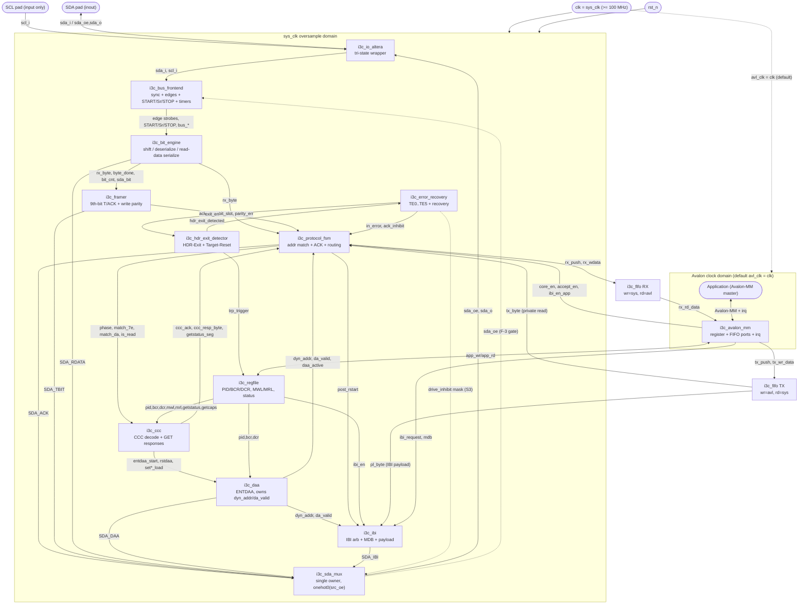
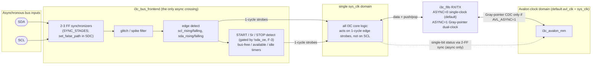

# Architecture & Formal Verification Plan
## Device-Agnostic SystemVerilog I3C Basic v1.2 SDR + IBI Target (Avalon-MM application interface, open-source yosys/SymbiYosys formal flow)

---

## 0. Scope and v1 Design Decisions (resolving the open questions so properties are well-defined)

The requirements JSON leaves several behaviors as MAY/SHOULD or "implementation-defined". To write *meaningful* formal properties, v1 fixes the following. These are the assumptions the whole plan is built on; change them and the property table changes.

| Decision | Value chosen for v1 | Drives requirements |
|---|---|---|
| Role | Pure SDR-Only Target, never Controller-capable | R-BCR-03, R-ROLE-02, R-DBR-01, R-TOL-CRR, R-GETACCCR-01 |
| BCR constant | `8'b0000_0111` = 0x07: role=00, adv=0, virt=0, offline=0, IBI-payload=1, IBI-capable=1, maxspeed-limit=0 | R-BCR-02..08, R-MDB-BCR2 |
| DCR constant | `0x00` (Generic Device) | R-DCR-02 |
| IBI | Supported, **with** one Mandatory Data Byte (BCR[2]=1); optional additional payload bytes supported, bounded by Max IBI Payload Size | R-MDB-01, R-IBI-*, R-MDB-04 |
| DA assignment methods | **ENTDAA mandatory**; SETDASA + SETAASA optional via `STATIC_ADDR_EN` parameter; SETNEWDA supported | R-DAA-01, R-ADDR-DASA-*, R-ADDR-NDA-* |
| Group addressing | **Not implemented** → matcher = {7'h7E, dynamic addr} only; all group-match signals tied 0 (group properties become vacuous/`assume`d false) | R-GRP-*, R-SETGRPA-*, R-GCAP2-ZEROS |
| HDR | None; **HDR Exit Pattern detector + Target Reset Pattern detector mandatory** | R-HDR-01, R-HDREXIT-*, R-TRP-* |
| ACK gating on DA match | `ack_da = da_valid && accept_en && fifo_can_accept && !pending_error` where `accept_en` is an Avalon-MM CTRL bit (passive-NACK = release SDA). This makes R-ACK-02 concrete. | R-ACK-02, R-GET-NACK-01 |
| Parity error on write data | Sets sticky `proto_err` (GETSTATUS LSB[5]) and a TE2 recovery; corrupted byte is **not** committed to RX FIFO | R-WR-02, R-TE2-01, R-STAT-02 |
| TE2/TE5/TE6 post-CCC recovery | **Option (2): discard everything until STOP or Repeated START** (uniform, simplest to verify) | R-TE2-02, R-TE5-02, R-TE6-05 |
| Real-time timers (tAVAL, tIDLE, tBUF, 60 µs, 150 µs, 50 ms) | Implemented as parameterized down-counters off `sys_clk`; verified by **cover** + bounded assertions, not by absolute-ns proofs | R-BUS-03/04, R-RD-04, R-REC-60US |
| Target Reset | Peripheral reset (default) + escalation to Whole-Target reset supported; escalation/arm flag and reset-action register live in an always-on reset domain | R-TRST-*, R-RSTACT-* |
| Clock | Target **never** drives SCL; single `sys_clk` (≥ 50 MHz) oversamples SDA/SCL | R-I2CF-04, R-DRV-02/03, R-CLK-02 |

---

## 1. Module Hierarchy (proposed files)

All RTL is device-agnostic except `i3c_io_altera.sv`. Unless noted, every block lives in the **`sys_clk` (oversample) domain**; the only true second domain is the optional Avalon-MM clock, isolated by FIFOs/handshakes.

```
i3c_target_top.sv
├── i3c_io_altera.sv          (Altera-specific, thin tri-state wrapper)
├── i3c_bus_frontend.sv       (sync + glitch filter + edge/START/STOP/Sr + bus-condition timers)
├── i3c_bit_engine.sv         (shift/deserialize, SDA drive mux, arbitration-loss detect)
├── i3c_framer.sv             (byte assembly, T-bit/parity, ACK/NACK slot control)
├── i3c_hdr_exit_detector.sv  (HDR Exit Pattern + Target Reset Pattern recognizer)
├── i3c_protocol_fsm.sv       (address match, private R/W, route to CCC / DAA / IBI)
├── i3c_daa.sv                (ENTDAA arbitration; SETDASA/SETAASA/SETNEWDA load)
├── i3c_ccc.sv                (CCC decode + handlers; supported-CCC/defining-byte tables)
├── i3c_ibi.sv                (IBI request, arbitration, MDB + payload, back-off)
├── i3c_error_recovery.sv     (TE0..TE6 detection + recovery/resync FSM)
├── i3c_regfile.sv            (PID/BCR/DCR identity, MWL/MRL, event-enable, status, reset-action)
├── i3c_avalon_mm.sv          (Avalon-MM agent: register access + FIFO data ports)
└── i3c_fifo.sv               (RX/TX FIFO; sync or async dual-clock for CDC)
```

### 1.0 Top-level block diagram

> See also **[docs/diagrams.md](diagrams.md)** for the per-module FSM state diagrams,
> transaction sequence diagrams (ENTDAA / SDR private write / SDR private read /
> GETSTATUS / IBI) and the SDA drive-ownership & contention diagram.

The flowchart below is the device-agnostic `i3c_target_top` netlist (the FROZEN
connectivity of `docs/interfaces.md` §4). It shows the physical pads feeding
`i3c_io_altera` → `i3c_bus_frontend`, the single-owner `i3c_sda_mux` fed by every
SDA drive source (`SDA_ACK` / `SDA_TBIT` / `SDA_RDATA` / `SDA_DAA` / `SDA_IBI`), and
the byte datapath `bus_frontend → bit_engine → framer → protocol_fsm →
(ccc / daa / ibi) → regfile + RX/TX FIFO → avalon_mm → application`. Edges are
labelled with the load-bearing signals; subgraphs mark the two clock domains
(default `avl_clk = clk`).



### 1.1 `i3c_io_altera.sv` — IO / tri-state wrapper (Altera-specific, thin)
- **Responsibility:** Map the device-agnostic open-drain model onto a physical pad. SDA pad = `ALTIOBUF`/`tri` with `oe`/`o`/`i`; SCL pad = **input only**. Push-pull vs open-drain expressed as: open-drain → `oe = drive_low`, `o = 0`; push-pull → `oe = 1`, `o = bit`. No internal weak pull-up active in push-pull phases (R-ELEC-05). Drive strength/Schmitt set by SDC/QSF, not RTL.
- **Inputs:** `sda_oe`, `sda_o`, `scl_oe(=0)`.
- **Outputs:** `sda_i`, `scl_i`; bidir pads `SDA`, `SCL`.
- **Clocking:** combinational/pad; no clock.
- **Reqs:** R-BUS-01/02, R-DRV-01/02/03, R-ACK-05, R-ELEC-03/05.
- **Formal note:** Replaced in the formal harness by an **abstract wired-AND bus model**: `sda_bus = (target_drive_low ? 0 : other_drivers)` so contention is observable.

### 1.2 `i3c_bus_frontend.sv` — bus front-end
- **Responsibility:** 2–3 FF synchronizers on SDA/SCL; programmable N-sample glitch/spike filter (R-SPK-01, disabled in pure-I3C high-speed); SCL/SDA edge detect (`scl_rising_stb`, `scl_falling_stb`, `sda_rising`, `sda_fall`); **START / Repeated-START / STOP** detection (SDA edge while SCL high), distinguishing plain START (after Bus-Free) from Sr; Bus-Free/Available/Idle timers (R-BUS-03/04/05).
- **Inputs:** `sda_i`, `scl_i`, `sys_clk`, `rst_n`, filter/threshold params.
- **Outputs:** synchronized `sda_sync`/`scl_sync`, edge strobes, `start_stb`, `rstart_stb`, `stop_stb`, `bus_free`, `bus_available`, `bus_idle`.
- **Clocking:** `sys_clk`. **CDC boundary lives here** (the only async inputs in the whole design).
- **Reqs:** R-CLK-01/02, R-RS-01, R-BUS-03/04/05, R-IBI-02, R-TRP-NOSDA, R-FMT-SDR-SAMPLE.

### 1.3 `i3c_bit_engine.sv` — bit-level shift / deserialize
- **Responsibility:** Sample SDA on `scl_rising_stb`; shift MSb-first into an 8-bit register; drive SDA per the requested mode at the right edges (open-drain `0`/Z; push-pull `0`/`1`). Implements **arbitration**: drive-`1`=release+monitor; on `(tx_bit==1 && sda_sampled==0)` latch `arb_lost` and tri-state for the rest of the header.
- **Inputs:** edge strobes, `tx_bit`, `tx_mode (OD/PP)`, `drive_en`, `sda_sampled`.
- **Outputs:** `rx_byte`, `bit_cnt`, `byte_done`, `arb_lost`, `sda_oe`, `sda_o`.
- **Clocking:** `sys_clk`, gated by SCL edge strobes.
- **Reqs:** R-ARB-01/02, R-DAA-06, R-IBI-05/ARB-01, R-FMT-05 (MSb-first), R-WR-01.

### 1.4 `i3c_framer.sv` — byte + T-bit / parity framing
- **Responsibility:** Track 8 data bits + a 9th "T/ACK" slot; decide whether the 9th bit is ACK/NACK (after address) or a T-bit (after data) (R-FMT-02); compute write odd parity `expected_t = ~(^rx_byte)`; generate read end-of-data T-bit (T=0 last, T=1 continue); detect read-abort Sr after a continue-T.
- **Inputs:** `rx_byte`, `phase (ADDR/DATA)`, `is_read`, `more_read_data`, edge strobes.
- **Outputs:** `parity_ok`, `ack_slot`, `tbit_slot`, `t_drive_val`, `read_abort`.
- **Clocking:** `sys_clk`.
- **Reqs:** R-WR-02, R-RD-01/02/03, R-TBIT-01..04, R-FMT-02, R-READ-TBIT.

### 1.5 `i3c_hdr_exit_detector.sv` — HDR Exit / Target Reset Pattern detector
- **Responsibility:** Shared SDA-falling-edge counter qualified by `scl_sync==0`; `scl_sync==1` resets the counter (synchronous equivalent of the async-reset reference, Listing 1). **4 falls → HDR Exit**; **14 transitions then Sr then STOP → Target Reset Pattern**. Enable = `is_hdr || err_recoverable`. Distinguishes Exit (4) from Reset (14) so an Exit never triggers a reset.
- **Inputs:** `sda_sync`, `scl_sync`, edge strobes, `exit_en`.
- **Outputs:** `hdr_exit_detected`, `trp_body_valid`, `trp_trigger`.
- **Clocking:** `sys_clk`.
- **Reqs:** R-HDR-01, R-HDREXIT-01..07, R-TRP-RECOG/TRIGGER/DISTINGUISH, R-TE0-02, R-REC-CE2.

### 1.6 `i3c_protocol_fsm.sv` — protocol FSM
- **Responsibility:** Top SDR sequencer. On START/Sr re-arms address capture; matches `7'h7E` and dynamic address (R-FMT-04: match on first addr after *any* (R)START, even without preceding 7E); routes 7E/W→CCC, 7E/R(in DAA)→DAA, DA/W→private write, DA/R→private read; owns the ACK driver for the address slot; transitions to IGNORE on no-match/NACK.
- **Inputs:** `rx_byte`, `byte_done`, `start/rstart/stop_stb`, `da_valid`, `dyn_addr`, `accept_en`, error/HDR flags.
- **Outputs:** `state`, `match_7e`, `match_da`, `ack_drive`, `is_broadcast`, route selects.
- **Clocking:** `sys_clk`.
- **Reqs:** R-ADDR-01..05, R-ACK-01..05, R-WR-01/03, R-RS-01/02, R-FMT-01/03/04/06.

### 1.7 `i3c_daa.sv` — DAA / address assignment
- **Responsibility:** ENTDAA participation gated by `!da_valid`; drive `{PID[47:0],BCR,DCR}` MSb-first open-drain with per-bit arbitration; receive assigned 7-bit DA + odd-parity PAR, ACK if `PAR == ~(^da[6:0])`, latch DA; re-arm on NACK with **same PID**; clean STOP exit. Also loads DA from SETDASA/SETAASA/SETNEWDA (when enabled). Clears DA on RSTDAA / whole-reset.
- **Inputs:** PID/BCR/DCR, edge strobes, `rx_byte`, CCC decode strobes.
- **Outputs:** `dyn_addr`, `da_valid`, `daa_drive`, `daa_done`.
- **Clocking:** `sys_clk`.
- **Reqs:** R-DAA-01..13, R-PID-01..04, R-ADDR-DASA-*, R-ADDR-NDA-*, R-COL-01.

### 1.8 `i3c_ccc.sv` — CCC decoder / handler
- **Responsibility:** Classify Broadcast (code[7]=0) vs Direct (code[7]=1); supported-code + supported-defining-byte tables → ACK/NACK at directed address (umbrella R-CCC-NACK-01); decode ENEC/DISEC, RSTDAA, ENTDAA, SET/GET MWL/MRL, SETDASA/SETNEWDA, GETPID/GETBCR/GETDCR, **GETSTATUS (Required)**, GETCAPS Fmt1, RSTACT, ENTHDRx→quiesce, ENTTM/ENTASx/DEFTGTS/SETBUSCON→ignore; sticky defining byte across segments; NACK 0x86, PRECR, CRHDLY, GETACCCR.
- **Inputs:** `rx_byte`, framing, `da_valid`, `match_da`, regfile read ports.
- **Outputs:** `ccc_code`, `ccc_is_direct`, `ccc_supported`, `ccc_ack`, regfile write strobes, `enthdr_seen`, `ibi_en` updates, `proto_err`.
- **Clocking:** `sys_clk`.
- **Reqs:** R-CCC-01..05, R-CCC-RECOG/END/PREMATURE/IGNORE-EXTRA, R-DIR-*, R-UNSUP-*, R-DEFB-*, R-GET-*, R-EVT-*, R-MWL-*, R-MRL-*, R-ID-*, R-STAT-*, R-RSTACT-*, R-GETCAPS-*, R-GETMXDS-*, R-HDR-01/02.

### 1.9 `i3c_ibi.sv` — IBI engine
- **Responsibility:** Gate on `bcr[1] && ibi_en && da_valid && bus_available && plain-START && !post-rstart`; drive `{dyn_addr[6:0],1'b1}` open-drain with arbitration; on ACK and BCR[2]=1 hand off to push-pull MDB then optional payload (each + T), bounded by Max IBI Payload Size; on NACK/arb-loss release + back-off; defer on RnW/double-NACK collisions; tolerate START+7E arbitrable header; Pending-Read-Notification path (optional).
- **Inputs:** `ibi_request`, `mdb`, payload FIFO, `bcr`, `ibi_en`, bus/arb status.
- **Outputs:** `ibi_drive`, `ibi_addr`, `ibi_state`, status flags.
- **Clocking:** `sys_clk`.
- **Reqs:** R-IBI-01..08, R-ARB-01, R-MDB-01..07, R-PRN-01..10, R-TOL-01/02/03, R-ENEC-01..03, R-EVT-01..04, R-GRP-02, R-IBI-01(grp).

### 1.10 `i3c_regfile.sv` — register / identity block
- **Responsibility:** Read-only constants PID(48)/BCR(8)/DCR(8); MWL/MRL + Max IBI Payload (write via SET*, range-checked, read via GET*); event-enable (`ibi_en` default 1); GETSTATUS assembler (proto_err R/clear-on-read, pending-interrupt encoder independent of `ibi_en`); GETCAPS constants; RSTACT reset-action + escalation-arm (always-on domain).
- **Inputs:** strap params, CCC write strobes, Avalon writes, reset events.
- **Outputs:** all constants/regs to bus side + Avalon side.
- **Clocking:** `sys_clk`; escalation/arm + reset-action in always-on sub-domain.
- **Reqs:** R-BCR-01..08, R-DCR-01/02, R-PID-01..04, R-MWL/MRL-*, R-STAT-01..06, R-EVT-02, R-DCR-01/02, R-DEFB-RSTACT, R-GCAP*.

### 1.11 `i3c_error_recovery.sv` — SDR error FSM
- **Responsibility:** TE0 (restricted-addr / 7E-R-outside-DAA), TE1 (CCC-code parity), TE2 (write-data parity), TE3 (DAA PAR), TE4 (non-7E/R after Sr in DAA), TE5 (illegal-format CCC), TE6 (optional read-back). Recovery arcs: TE0/TE1→ignore until HDR Exit (or optional 60 µs); TE2/TE5/TE6→discard until STOP/Sr; TE3/TE4→NACK then PID-replay/STOP. Global CE2 recovery (HDR Exit + STOP). Guarantees no deadlock and no false ACK while in error.
- **Inputs:** parity flags, addr/CCC legality, `in_entdaa`, edge strobes, HDR-exit.
- **Outputs:** `in_error`, `err_recoverable`, ACK/drive inhibits, `proto_err`.
- **Clocking:** `sys_clk`.
- **Reqs:** R-ERR-00, R-TE0-01..04, R-TE1..TE6-*, R-REC-RESYNC, R-REC-CE2, R-REC-60US.

### 1.12 `i3c_avalon_mm.sv` — Avalon-MM bridge
- **Responsibility:** Avalon-MM agent: `address/read/write/readdata/writedata/byteenable/waitrequest/readdatavalid`. Decodes register map (§3); pushes TX bytes / pops RX bytes via FIFO ports; raises `irq`. Pipelined or fixed-latency; **must never assert `readdatavalid` without a prior read, never drop a non-wait-requested command** (Avalon-MM safety).
- **Inputs:** Avalon master signals, regfile, FIFO status.
- **Outputs:** register writes, FIFO push/pop, `readdata`, `irq`, `waitrequest`.
- **Clocking:** Avalon clock (may = `sys_clk`).
- **Reqs:** R-TRST-PERIPH-NOTIFY, all application-visible behavior; Avalon-MM compliance properties.

### 1.13 `i3c_fifo.sv` — RX/TX FIFO (CDC)
- **Responsibility:** Decouple bus byte-rate from application. **Single-clock** if Avalon clock = `sys_clk`; **dual-clock async (Gray pointers)** if different. RX depth ≥ MWL handling; TX feeds read/IBI data.
- **Clocking:** dual-domain; Gray-coded pointer CDC.
- **Reqs:** R-CCC-02 (GETSTATUS never blocked by FIFO), R-MWL-04 (no overrun).

---

## 2. Clocking Strategy

### 2.1 Recommendation: oversampled, single `sys_clk`, no SCL-clocked logic
The Target **never drives SCL** (R-I2CF-04, R-DRV-02/03) and must tolerate arbitrary SCL duty cycle and sub-50 ns High periods at up to 12.5 MHz sustained / 12.9 MHz burst (R-CLK-01/02, R-TIM-01). Therefore:

- Treat **SDA and SCL as asynchronous inputs**. Synchronize each through 2–3 FFs (`i3c_bus_frontend`). Run **all** I3C logic on a free-running `sys_clk` and act on **detected SCL edges** (`scl_rising_stb`/`scl_falling_stb`), not on SCL as a clock.
- **Required oversampling factor:** minimum SCL half-period and minimum HDR-Exit inter-edge spacing are `tDIG_H ≥ 32 ns`; min `tHIGH ≈ 24 ns` (R-TIM-01, R-HDREXIT-02). To reliably catch a 24–32 ns High pulse and place setup/hold, sample at ≥ ~4× → **`sys_clk` ≥ 50 MHz, target 80–100 MHz**. At 100 MHz a 32 ns pulse = ~3 samples; choose `sys_clk` so min pulse ≥ 3 samples after synchronizer latency.

### 2.2 Why oversampled, not SCL-clocked
| Concern | SCL-clocked design | Oversampled `sys_clk` (chosen) |
|---|---|---|
| SCL stops between bytes / long Low | Clock domain dies; timers (tAVAL/tIDLE, 60/150 µs, 50 ms) impossible | Free-running clock keeps timers + watchdogs alive (R-BUS-*, R-RD-04, R-REC-60US) |
| Sub-50 ns High, arbitrary duty | Edge/level detection unreliable; setup/hold to a glitchy SCL | Edges detected as strobes; glitch filter decouples (R-CLK-02) |
| START/STOP/Sr = SDA edge **while SCL High** | Needs async SDA capture relative to SCL — messy | Both lines sampled in one domain; condition = combinational on synced lines (R-RS-01) |
| HDR Exit / Target Reset patterns (SDA edges with SCL Low) | Reference uses SDA-as-clock + async reset → bad for STA/formal | Pure synchronous edge counter, clean for yosys + Quartus STA (R-HDREXIT-08) |
| Open-source formal | Multiple/derived clocks complicate SymbiYosys | **Single clock** → simplest BMC/induction |

### 2.3 CDC concerns
1. **SDA/SCL → `sys_clk`:** the only true async crossing; 2–3 FF synchronizers + glitch filter. Metastability mitigation must be proven adequate by SDC (`set_false_path`) — outside formal; formally we **assume** synced lines change no faster than the oversample budget.
2. **`sys_clk` ↔ Avalon clock:** if different, **async FIFOs with Gray pointers** for RX/TX data; single-bit control/status crossed with 2-FF synchronizers; multi-bit config crossed via FIFO or req/ack handshake (never bit-by-bit). **Recommendation: tie Avalon clock = `sys_clk`** to eliminate this crossing entirely; use async FIFO only if the application mandates a separate clock.
3. **Reset domains:** `sys_clk` reset (synchronized de-assert) for the peripheral; an **always-on** retention domain holds `reset_action_reg` and `escalation_armed` so a peripheral reset cannot lose escalation state (R-TRST-ESC2, open-question on reset partitioning).

### 2.3.1 Clocking / CDC diagram

The diagram below shows the only true asynchronous crossing — `SDA`/`SCL` →
`i3c_bus_frontend` synchronizers — being converted into 1-cycle **edge strobes**
that drive the entire single `sys_clk` core (which never uses SCL as a clock), and
the optional Avalon-clock boundary that is **tied to `sys_clk` by default**
(`AVL_ASYNC=0`), so the Gray-pointer FIFO CDC only exists when the application
mandates a separate `avl_clk`.



### 2.4 Formal abstraction of the clocking
To keep BMC depths tractable, the proof is **decomposed**:
- **Front-end proofs** (synchronizer + filter + edge/START/STOP/Sr) are local and small.
- **Everything above the bit-engine is proven against an *idealized edge model*:** the harness drives `scl_rising_stb`/`scl_falling_stb`/`bus_event` strobes directly (one strobe = one settled bus edge), with an `assume` that strobes are at least K cycles apart. This removes the oversampling counter from the deep proofs and lets one "step" ≈ one bus bit.

---

## 3. Avalon-MM Register Map (DRAFT)

32-bit registers, word-aligned (byte offset = index×4). `byteenable` honored on writes. RO = read-only, RW = read/write, W1C = write-1-to-clear, WO = write-only (FIFO push), COW = clear-on-(GETSTATUS)-read on bus side.

| Offset | Name | Bits | R/W | Field / meaning | Reqs |
|---|---|---|---|---|---|
| 0x00 | `CTRL` | [0] core_en; [1] accept_en (ACK private R/W on DA match); [2] ibi_en_app (app gate, AND with bus `ibi_en`); [3] soft_reset; [4] static_addr_en; [5] prn_send_en; [6] flush_rx; [7] flush_tx | RW | Master enables; `accept_en` realizes R-ACK-02 passive-NACK gate | R-ACK-02, R-MIN-01, R-PRN-09 |
| 0x04 | `STATUS` | [0] da_valid; [1] i3c_mode; [2] in_hdr_quiesce; [3] in_error; [6:4] bus_state; [10:7] te_code(last TE); [11] ibi_busy; [12] proto_err_seen; [13] rx_overflow; [15:14] resv | RO | Live core status | R-I2CF-03, R-HDR-01, R-ERR-* |
| 0x08 | `INT_ENABLE` | mirror of INT_STATUS bits | RW | Per-source IRQ enable | (Avalon irq) |
| 0x0C | `INT_STATUS` | [0] rx_ready; [1] tx_space; [2] priv_write_done; [3] priv_read_req; [4] ibi_done; [5] ibi_nacked; [6] da_changed; [7] periph_reset; [8] proto_err; [9] ccc_event(ENEC/DISEC/SET*) | W1C | Application interrupts | R-TRST-PERIPH-NOTIFY, R-STAT-02 |
| 0x10 | `DYN_ADDR` | [6:0] dyn_addr; [7] da_valid | RO | Current DA (bus-written only) | R-ROLE-02, R-ADDR-02(.3.3) |
| 0x14 | `PID_LOW` | PID[31:0] | RW@init | Vendor-fixed/random part; strap-overridable | R-PID-01/02/04 |
| 0x18 | `PID_HIGH` | [15:0] PID[47:32] | RW@init | MfgID[14:0]+type-sel; MfgID never randomized | R-PID-02/03 |
| 0x1C | `IDENT` | [7:0] BCR; [15:8] DCR; [22:16] static_addr; [23] static_addr_valid | RW@init (BCR/DCR effectively const) | Identity | R-BCR-*, R-DCR-*, R-ADDR-01/02(.3.1) |
| 0x20 | `MWL` | [15:0] max_write_len | RW | SET/GET MWL store; range-checked | R-MWL-1..4 |
| 0x24 | `MRL` | [15:0] max_read_len; [23:16] max_ibi_payload (0=unlimited) | RW | SET/GET MRL store | R-MRL-1..5 |
| 0x28 | `IBI_CTRL` | [0] ibi_request(W1S/auto-clear); [12:5] mdb; [15] mdb_is_prn; [23:16] payload_len | RW | Trigger IBI + MDB/payload config | R-IBI-01..07, R-MDB-*, R-MDB-FORMAT |
| 0x2C | `IBI_STATUS` | [0] ibi_pending; [1] ibi_acked; [2] ibi_nacked; [3] arb_lost; [4] deferred | RO | IBI result | R-IBI-06/08, R-IBI-04/05, R-TOL-03 |
| 0x30 | `RX_DATA` | [7:0] data; [8] valid; [9] last(STOP/Sr); [10] is_ccc | RO (pop) | Private-write / CCC-write bytes | R-ACK-03, R-CCC-IGNORE-EXTRA |
| 0x34 | `TX_DATA` | [7:0] data; [8] last (drives T=0) | WO (push) | Private-read / GET / IBI payload bytes | R-RD-01/02, R-DIR-READ-RESP |
| 0x38 | `FIFO_STATUS` | [7:0] rx_level; [15:8] tx_level; [16] rx_empty; [17] tx_full | RO | FIFO occupancy | R-MWL-04 |
| 0x3C | `GETSTATUS_CFG` | [7:0] vendor_msb; [9:8] activity_mode; [13:10] pending_irq | RW | Drives GETSTATUS Format-1 word | R-STAT-01/03 |
| 0x40 | `CAPS` | [7:0] GETCAP1(0); [15:8] GETCAP2(0x02+grp/abort); [23:16] GETCAP3; [31:24] GETCAP4(0) | RW@init | GETCAPS bytes | R-GCAP1/2/3/4-* |
| 0x44 | `RESET_CFG` | [1:0] reset_action(0=none,1=periph,2=whole); [2] escalation_armed(RO); [3] last_reset_was_whole(RO) | RO/RW | RSTACT mirror + escalation | R-TRST-*, R-DEFB-RSTACT |

`irq = |(INT_STATUS & INT_ENABLE)`.

---

## 4. Prioritized Formal Property Plan

### 4.0 yosys/SymbiYosys SVA subset rules (binding constraint for every property)
**Allowed:** immediate assertions inside clocked `always_ff`/`always @(posedge clk)` using `$past`, `$rose`, `$fell`, `$stable`, `$onehot`, `$countones`; concurrent `assert/assume/cover property (@(posedge clk) disable iff(!rst_n) ...)` with boolean antecedent and **`|->`, `|=>`, fixed `##N`** only.
**Forbidden (no Verific):** `throughout`, `until`, `s_eventually`, `within`, `intersect`, `first_match`, goto/non-consecutive `[->]`/`[=]`, unbounded `[*]`/`##[1:$]`, local vars, `let`, multiclock. Wherever a sketch in the JSON used `throughout`/`until`/`##[1:$]`, it is **rewritten below** as a sticky-flag invariant or a bounded `##N` / counter assertion.
**Liveness/resync** ("eventually return to idle") is expressed two ways: (a) a **bounded safety** form — `recovery_event |=> next_state==IDLE`; and (b) a **`cover`** that the resync state is reachable; plus an optional **bounded watchdog** assertion `in_error && stuck_cnt==MAX |-> 1'b0`.
**Proof method legend:** BMC = bounded model check to depth D (bug-hunting, framing); K-IND = k-induction (`mode prove`) for unbounded invariants; COVER = reachability witness.

### 4.A Safety invariants — no bus contention / drive only when permitted (HIGHEST priority)
| # | Property (subset-legal sketch) | Reqs | Method | Abstraction / assumption |
|---|---|---|---|---|
| S1 | `scl_oe == 1'b0` always (structural) | R-DRV-02/03, R-I2CF-04 | K-IND d1 | structural — Target has no SCL driver |
| S2 | `open_drain_phase \|-> !(sda_oe && sda_o==1'b1)` (never actively drive High in OD) | R-BUS-02, R-ACK-05, R-DAA-07 | K-IND | wired-AND bus model |
| S3 | `(state==IGNORE \|\| in_error \|\| in_hdr_quiesce) \|-> !sda_oe` | R-ADDR-03, R-ACK-04, R-HDR-02, R-TE0-02 | K-IND | — |
| S4 | `(post_rstart && addr_phase) \|-> !sda_oe` (no arbitration after Sr; only ACK driver) | R-IBI-06, R-DAA-08 | K-IND | track `post_rstart` sticky from front-end |
| S5 | `!exit_en \|-> !hdr_exit_action` (no spurious recovery) | R-HDREXIT-06 | K-IND | — |
| S6 | `(wr_data_phase \|\| wr_tbit_phase) \|-> !sda_oe` (never drive during Controller write) | R-WR-01 | BMC d≈20 + K-IND | edge-model |
| S7 | never drive Hot-Join / CRR: `!sda_drive_for_hj && !sda_drive_for_crr`; `own_addr != 7'h02` | R-TOL-HJ, R-HJ-01, R-TOL-CRR | K-IND | constants |
| S8 | `arb_lost \|-> !sda_oe` (released for rest of header) | R-ARB-02, R-DAA-06 | K-IND | — |
| S9 | contention freedom: `!(target_drive_low && controller_drive_high_pp)` in any phase | R-BUS-01/02, open-q(contention) | K-IND | wired-AND + controller env model |

### 4.B Protocol framing
| # | Property | Reqs | Method | Notes |
|---|---|---|---|---|
| F1 | 9th-bit role: `ninth_slot \|-> (phase==ADDR ? ack_nack_active : tbit_active)` | R-FMT-02 | BMC d≈30 | edge-model |
| F2 | `(start_stb\|\|rstart_stb) \|=> addr_capture_armed` | R-ADDR-04, R-FMT-04 | K-IND | — |
| F3 | `(addr_phase && (stop_stb\|\|rstart_stb)) \|=> capture_cancelled` (tolerate STOP/Sr mid-frame) | R-RS-01 | BMC | live detectors all states |
| F4 | `stop_stb \|=> (state==IDLE)` (clean STOP → idle) | R-CCC-END-01, R-DAA-13 | K-IND | — |
| F5 | `(match_7e && rnw==0 && first_byte_done) \|=> ccc_frame_active` | R-ADDR-05, R-CCC-RECOG-01 | BMC | — |
| F6 | `byte_index >= defined_len \|=> $stable(functional_regs)` (ignore surplus bytes) | R-CCC-IGNORE-EXTRA-01 | BMC | per-CCC length table |
| F7 | premature term safety: `(stop_stb\|\|rstart_stb during ccc) \|=> (state==IDLE && !sda_oe)` | R-CCC-PREMATURE-01 | BMC+COVER | policy=discard |

### 4.C Address matching
| # | Property | Reqs | Method | Notes |
|---|---|---|---|---|
| A1 | `(addr_done && rx_addr==7'h7E) \|-> match_7e` (always match broadcast) | R-ADDR-01(.3.2), R-ACK-7E-01, R-FMT-01 | K-IND | — |
| A2 | `match_da \|-> da_valid` (DA never matches pre-assignment) | R-ADDR-02, R-ADDR-RECOG-01 | K-IND | — |
| A3 | `(addr_done && !match_7e && !match_da && !daa_active) \|=> state==IGNORE` | R-ADDR-03, R-TOL-I2C | BMC | group tied 0 |
| A4 | DA change only via assignment: `dyn_addr != $past(dyn_addr) \|-> (entdaa_ack\|\|setdasa\|\|setaasa\|\|setnewda\|\|rstdaa\|\|reset)` | R-ROLE-02, R-ADDR-02(.3.3) | K-IND | — |
| A5 | after SETNEWDA: `da_changed \|-> (rx_addr==$past(dyn_addr) \|-> !ack_drive)` (no stale-DA ACK) | R-ADDR-NDA-02 | BMC | — |
| A6 | static addr legality (elaboration assert): `static_addr_valid \|-> !is_reserved && !is_TE0` | R-ADDR-01/02(.3.1) | K-IND d1 | combinational |

### 4.D ACK / NACK correctness
| # | Property | Reqs | Method | Notes |
|---|---|---|---|---|
| K1 | `(ack_slot && match_7e && scl_low) \|-> (sda_oe && sda_o==0)` (ACK 7E) | R-ACK-01, R-ACK-7E-01, R-CCC-01 | BMC | — |
| K2 | `(ack_slot && match_da && !accept_en) \|-> !sda_oe` (passive NACK) | R-ACK-02 | BMC | accept_en from Avalon |
| K3 | `(ack_slot && match_da && accept_en && scl_low) \|-> (sda_oe && sda_o==0)` | R-ACK-02, R-ADDR-01(.3.3) | BMC | — |
| K4 | `(ack_slot && match_da && !accept_en) \|=> (state==IGNORE && !sda_oe)` | R-ACK-04 | BMC | — |
| K5 | ACK is open-drain: `ack_slot \|-> open_drain_mode` | R-ACK-05 | K-IND | — |
| K6 | unsupported Direct CCC: `(direct_ccc && match_da && !ccc_supported && ack_slot) \|-> !sda_oe` | R-UNSUP-NACK-01, R-CCC-NACK-01, R-RSTDAAD-01, R-GETACCCR-01, R-RSTACT-02 | BMC | supported table |
| K7 | GETSTATUS always answerable: `(match_da && ccc==GETSTATUS && da_valid) \|-> can_ack_getstatus` (not FIFO-gated) | R-CCC-02, R-STAT-01 | K-IND | dedicated datapath |
| K8 | no false ACK: `(ack_slot && sda_oe && sda_o==0) \|-> (match_7e \|\| (match_da && enabled) \|\| daa_ack)` | R-FMT-06, R-ACK-01 | K-IND | high-value |
| K9 | group/read NACK (vacuous in v1): `(group_match && rnw==READ) \|-> !ack_drive` | R-GRP-01/03, R-GRP-03(.3.4) | K-IND | `assume !group_match` |
| K10 | GET-not-ready NACK: `(direct_get && match_da && !response_ready && ack_slot) \|-> !sda_oe` | R-GET-NACK-01 | BMC | response_ready def |

### 4.E T-bit / parity
| # | Property | Reqs | Method | Notes |
|---|---|---|---|---|
| T1 | write parity check: `tbit_slot_ctrl \|-> (parity_err == (sampled_t != ~(^rx_byte)))` | R-WR-02, R-TBIT-01 | BMC d1 | combinational |
| T2 | read end T=0: `(rd_tbit && end_read && scl_falling) \|-> (sda_oe && sda_o==0)` and `(...&&scl_rising) \|=> !sda_oe` | R-RD-01, R-READ-TBIT | BMC | — |
| T3 | read continue T=1: `(rd_tbit && !end_read && scl_falling) \|-> (sda_oe && sda_o==1)`; then release on rising | R-RD-02, R-TBIT-02 | BMC | push-pull then Z |
| T4 | read-abort detect: `(after_continue_t && scl_falling && !sda_sampled) \|=> (state==ABORTED && !sda_oe)` | R-RD-03, R-TBIT-04 | BMC | — |
| T5 | DAA PAR: `parity_valid == (rx_par == ~(^rx_da[6:0]))` | R-DAA-09/10 | BMC d1 | combinational |
| T6 | IBI/read data byte each followed by Target T-bit; last → T=0 | R-MDB-03, R-TBIT-02 | BMC | shared with T2/T3 |

### 4.F CCC handling
| # | Property | Reqs | Method | Notes |
|---|---|---|---|---|
| C1 | classify: `ccc_is_direct == ccc_code[7]` | R-BCAST-DIRECT-BIT7-01 | K-IND d1 | — |
| C2 | 0xFF/0x86/PRECR/CRHDLY/GETACCCR/SETBRGTGT/SETROUTE unsupported → NACK (subsumed by K6) | R-CCC-FF, R-RSTDAAD-01, R-STAT-06, R-GETMXDS-05, R-GETACCCR-01, R-BRG-01, R-ROUTE-01 | BMC | supported table |
| C3 | SETMWL/SETMRL commit: `setmwl_accept \|=> mwl==captured` ; out-of-range `\|=> $stable(mwl)` | R-MWL-1/3, R-MRL-1/3 | BMC | range param |
| C4 | GET* returns reg MSB-first: `getbcr_read&&ack \|-> data_out==bcr` (and DCR/PID 6B/MWL 2B/MRL 2or3B) | R-ID-BCR/DCR/PID, R-MWL-2, R-MRL-2 | BMC | byte counter |
| C5 | GETMRL 3rd byte iff BCR[2]: `getmrl&&bcr[2] \|-> data_count==3` | R-MRL-2 | BMC | — |
| C6 | ENEC/DISEC: `disec_to_me&&ev[0] \|=> !ibi_en` ; `enec_to_me&&ev[0] \|=> ibi_en` ; reset → `ibi_en==1` | R-EVT-01/02/03, R-ENEC-01/02/03 | BMC + K-IND | broadcast+direct forms |
| C7 | ignore-class CCCs don't error: `(enttm\|\|entas\|\|deftgts\|\|setbuscon\|\|defgrpa) \|=> !proto_err` | R-ACT-01, R-AS-*, R-DEFTGTS-01, R-SETBUSCON-01, R-EVT-05 | BMC | — |
| C8 | ENTDAA gating: `entdaa&&da_valid \|-> !daa_drive` ; `entdaa&&!da_valid \|-> daa_participate` | R-CCC-03, R-DAA-ENT-01/02, R-DAA-03 | BMC | — |
| C9 | RSTDAA clears DA: `rstdaa_done \|=> !da_valid` | R-DAA-RST-01, R-ADDR-02(.3.3) | BMC | — |
| C10 | sticky defining byte: `(defbyte_latched && !new_direct_code) \|=> $stable(defbyte)` | R-DEFB-STICKY-01, R-DEFB-TRACK-01 | K-IND | — |
| C11 | ENTHDRx quiesce: `enthdr_seen \|=> in_hdr_quiesce`; `in_hdr_quiesce&&!hdr_exit \|=> in_hdr_quiesce`; `hdr_exit \|=> !in_hdr_quiesce` | R-HDR-01(.3.7), R-HDR-01..03, R-HDREXIT-01..05, R-TOL-HDR | BMC+K-IND+COVER | sticky |
| C12 | GETCAPS ≥2 bytes; constants: GETCAP1==0, GETCAP2[3:0]==2, GETCAP2[7:4]==0, GETCAP4==0, GETCAP3 reserved bits 0 | R-GETCAPS-01/02, R-GCAP1/2/3/4-* | BMC + K-IND | constants |
| C13 | SETDASA gating: `setdasa&&has_da \|-> (!ack && $stable(dyn_addr))`; `setdasa&&!has_da&&static_match \|=> dyn_addr==db[7:1]` | R-ADDR-DASA-01/02, R-SETAASA-01 | BMC | static_en param |

### 4.G IBI correctness
| # | Property | Reqs | Method | Notes |
|---|---|---|---|---|
| I1 | IBI gating: `ibi_start_drive \|-> (bcr[1] && ibi_en && da_valid && bus_available && plain_start && !post_rstart)` | R-IBI-02/03(.3.6), R-IBI-01..05, R-BCR-04, R-EVT-03, R-ENEC-01 | K-IND | bus_available from timer |
| I2 | IBI header value: `ibi_header_active \|-> (tx_addr==dyn_addr && tx_rnw==1)` | R-IBI-01(.3.2), R-IBI-01(.3.6) | BMC | — |
| I3 | IBI address never group: `ibi_arb_active \|-> ibi_addr==dyn_addr` | R-GRP-02, R-IBI-01(partB) | K-IND | — |
| I4 | arb-loss release: `(ibi_arb && tx_bit==1 && scl_rising && !sda_sampled) \|=> (arb_lost && !sda_oe)` | R-ARB-01, R-IBI-05(.3.6), R-IBI-01(annexF) | BMC | — |
| I5 | MDB after ACK: `(ibi_acked && bcr[2]) \|=> ##[1:N] (mdb_drive && first_byte==MDB)` (bounded N) | R-MDB-01, R-IBI-07, R-MDB-MANDATORY | BMC dN | use fixed `##N` |
| I6 | no MDB when BCR[2]=0: `(ibi_acked && !bcr[2]) \|-> !mdb_drive` | R-MDB-02 | BMC | (vacuous, BCR[2]=1) |
| I7 | NACK release: `ibi_nacked \|=> (!sda_oe && ibi_idle)` | R-IBI-06/08, R-IBI-03(annexF) | BMC | — |
| I8 | defer collisions: `(ibi_pending && arb_addr_match && sampled_rnw==0) \|=> ibi_deferred`; double-NACK read case | R-IBI-04/05(.3.2) | BMC | — |
| I9 | payload bound: `ibi_payload_active && max!=0 \|-> payload_cnt <= max` | R-MDB-04, R-MRL-04 | K-IND | counter clamp |
| I10 | MDB format/groups: `ibi_mdb_valid \|-> mdb[7:5]!=3'b110 && mdb[7:5]!=3'b111`; PRN: `mdb[7:5]==3'b101 \|-> getcap3[6]` | R-MDB-FORMAT, R-MDB-GROUPS, R-MDB-PENDREAD, R-GCAP3-IBIMDB | K-IND | constrain source |
| I11 | PRN single-active: `prn_active \|-> !ibi_is_prn_start`; `(ibi_nacked\|\|term_before_mdb) \|-> !prn_active` | R-PRN-04/10 | BMC | optional feature |
| I12 | tolerate START+7E arbitrable header (IBI may drive into it) — COVER witness | R-TOL-01 | COVER | — |

### 4.H Error recovery / resync (liveness rewritten as bounded safety + cover)
| # | Property | Reqs | Method | Notes |
|---|---|---|---|---|
| E1 | TE0 detect: `(da_valid && !in_entdaa && header_after_start && {addr,rnw} inside RESTRICTED) \|=> te0_err` | R-TE0-01, R-ERR-TE0 | BMC | LUT of 8 codes |
| E2 | TE0 masked in DAA: `in_entdaa \|-> (!te0_err && te4_active)` | R-TE0-03 | K-IND | — |
| E3 | TE0/TE1 recovery state quiet: `(te0_err\|\|te1_err) \|-> (!ack_drive && !sda_oe)` (replaces `throughout`) and `hdr_exit_detected \|=> resync_idle` | R-TE0-02, R-TE1-01, R-REC-RESYNC | K-IND + BMC | sticky in_error |
| E4 | TE2/TE5/TE6 recovery: `te_err \|-> !wr_commit` and `(stop_stb\|\|rstart_stb) \|=> state==IDLE` | R-TE2-01/02, R-TE5-01/02, R-TE6-04/05 | BMC | discard policy |
| E5 | TE3 (DAA PAR): `(in_entdaa && par_err) \|-> (nack_after_par && !da_latched)`; next 7E/R → PID replay (cover) | R-TE3-01, R-DAA-03 | BMC+COVER | — |
| E6 | TE4: `(in_entdaa && rstart && {addr,rnw}!={7E,1}) \|=> nack_then_wait_stop` | R-TE4-01, R-DAA-04 | BMC | — |
| E7 | legal-but-unsupported ≠ TE5: `(direct_ccc && well_formed && !supported) \|-> (!te5_err && nack_path)` | R-TE5-03, R-ERR-CCC-UNSUP | BMC | classify split |
| E8 | global CE2/STOP resync (bounded form): `hdr_exit_detected \|=> idle_ready`; `(in_error && stop_stb) \|=> idle_ready` | R-REC-CE2, R-REC-RESYNC | K-IND | sticky-flag |
| E9 | no-deadlock witnesses: `cover(in_error)` then `cover(in_error ##[0:DMAX] idle_ready)` for each TE; watchdog `in_error && stuck_cnt==MAX \|-> 0` | R-REC-RESYNC, R-CCC-PREMATURE-01, R-DAA-13 | COVER + BMC | DMAX param |
| E10 | proto_err sticky/clear: `protocol_error_event \|=> proto_err`; `getstatus_read_complete \|=> !proto_err` | R-STAT-02 | BMC | read-to-clear |

### 4.I Target Reset
| # | Property | Reqs | Method | Notes |
|---|---|---|---|---|
| R1 | TRP recognize: `(scl_low && sda_edge_cnt==14 && sda==1) \|-> trp_body_valid` | R-TRP-RECOG | BMC | counter |
| R2 | distinguish Exit(4) vs Reset(14): `hdr_exit_detected && !trp_body_valid \|-> !trp_trigger` | R-TRP-DISTINGUISH | K-IND | — |
| R3 | trigger order: `trp_body_valid` then `rstart` then `stop` → `trp_trigger` (fixed `##N` window) | R-TRP-TRIGGER | BMC | — |
| R4 | clear action on START not Sr: `(start_stb && !rstart_stb) \|=> reset_action==NONE`; `rstart_stb \|=> $stable(reset_action)` | R-RSTACT-03, R-TRST-CLRCFG | BMC | START/Sr discrimination |
| R5 | escalation: `(!rstact_cfg && !armed && trp) \|-> (periph_reset && armed')`; `(armed && !intervening && trp) \|-> whole_reset`; `(rstact\|\|getstatus) \|=> !armed` | R-TRST-DEFAULT1/ESC2/DISARM | BMC | always-on flag |
| R6 | whole reset clears config: `whole_reset \|=> (!da_valid && config==DEFAULT)`; periph reset `\|-> !chip_logic_reset` | R-TRST-WHOLE, R-TRST-PERIPH-NOCHIP | K-IND | reset domains |
| R7 | no SDA pull during TRP: `(scl_fell_from_idle && !prior_start) \|-> !sda_oe` (bounded window) | R-TRP-NOSDA | BMC | — |

### 4.J Avalon-MM compliance
| # | Property | Reqs | Method | Notes |
|---|---|---|---|---|
| V1 | `readdatavalid` only after an accepted read: `readdatavalid \|-> $past(read_accepted, latency)` | Avalon spec | K-IND | fixed-latency model |
| V2 | no command drop: `(read\|\|write) && waitrequest \|=> $stable(address)&&$stable(write)&&$stable(writedata)` | Avalon spec | K-IND | master holds |
| V3 | W1C semantics: `int_status[i] && w1c_write[i] \|=> !int_status[i]` (unless re-set same cycle) | R-STAT-02, INT_STATUS | BMC | — |
| V4 | RO regs never written by Avalon: `$stable(bcr)&&$stable(dcr)&&$stable(pid)` under bus writes | R-BCR-01, R-DCR-01 | K-IND | — |
| V5 | no RX overrun / FIFO safety: `rx_push && rx_full \|-> rx_overflow_flag` (no silent loss) | R-MWL-04 | K-IND | FIFO model |
| V6 | irq correctness: `irq == \|(int_status & int_enable)` | INT logic | K-IND d1 | combinational |

### 4.K Identity / characteristic constants (cheap, do first)
| # | Property | Reqs | Method |
|---|---|---|---|
| ID1 | `bcr==8'h07`, `bcr[7:6]==00`, `bcr[5:4]==00`, `bcr[3]==0`, `bcr[2:1]==11`, `bcr[0]==0` | R-BCR-02..08 | K-IND d1 |
| ID2 | `dcr==DCR_CONST` and stable | R-DCR-01/02 | K-IND d1 |
| ID3 | `pid[47:33]==MFG_ID_CONST` (never randomized) | R-PID-03 | K-IND d1 |
| ID4 | GETPID/ENTDAA payload == regfile PID/BCR/DCR (consistency) | R-DAA-04/05, R-ID-PID/BCR/DCR | BMC |

---

## 5. Phased Implementation Plan (vertical slices, each ends in a formal proof)

Each slice produces synthesizable RTL **plus** its SymbiYosys `.sby` (BMC + `prove` + cover) and **passes before the next slice starts**. Bind files (`i3c_*_props.sv`) attach assertions; the abstract bus + idealized-edge harness from §2.4 is reused.

**Slice 0 — Harness & identity (1 wk).**
Build `i3c_io_altera` abstract bus model, `i3c_regfile` constants, the edge-strobe harness. Prove §4.K (ID1–ID4) and §4.A S1, S7. *Exit: constants + "never drive SCL / never HJ/CRR" proven.*

**Slice 1 — Front-end & bus conditions (1–2 wk).**
`i3c_bus_frontend`: synchronizers, glitch filter, edge detect, START/Sr/STOP, bus-free/available/idle timers. Prove F2, F3, F4 (framing arming/cancel), plus cover that START/Sr/STOP are reachable and distinguishable. *Exit: clean bus-event layer the rest builds on.*

**Slice 2 — Bit engine + framing + open-drain discipline (2 wk).**
`i3c_bit_engine` + `i3c_framer`. Prove §4.A S2/S3/S6/S8, §4.B F1, §4.E T1/T2/T3/T4/T5, §4.K K5. *Exit: shift/T-bit/parity + "drive only when permitted" proven at bit level.*

**Slice 3 — Address match + ACK/NACK + private R/W (2 wk).**
`i3c_protocol_fsm` private-write/read path; wire `accept_en`, RX/TX FIFO ports. Prove §4.C A1–A4, §4.D K1–K5, K8, §4.B F5/F6/F7, §4.E T6. First end-to-end private write and read. *Exit: a Controller can privately R/W an addressed Target, no false ACK, no contention.*

**Slice 4 — DAA (ENTDAA) + dynamic address lifecycle (2 wk).**
`i3c_daa`: arbitration, PID/BCR/DCR shift, PAR check, latch, re-arm. Prove §4.K ID4, §4.C C8/C9, §4.H E2/E5/E6 (TE3/TE4), §4.A A4. Cover full DAA round and abort/restart (R-DAA-13). *Exit: Target obtains, holds, and on RSTDAA releases a DA; tolerates aborted DAA.*

**Slice 5 — CCC decoder + Required CCCs (2–3 wk).**
`i3c_ccc`: classify, supported tables, ENEC/DISEC, GETSTATUS, GET PID/BCR/DCR, SET/GET MWL/MRL, GETCAPS Fmt1, SETDASA/SETNEWDA, sticky defining byte, ENTHDRx→quiesce, ignore-class. Prove §4.F C1–C13, §4.D K6/K7/K9/K10. *Exit: full mandatory-CCC conformance incl. unsupported-NACK umbrella.*

**Slice 6 — IBI engine (2 wk).**
`i3c_ibi`: gating, arbitration, MDB + payload handoff, back-off, defer, PRN. Prove §4.G I1–I12, plus C6 re-check (ENEC/DISEC ↔ ibi_en). Cover ACKed-IBI-with-MDB and NACKed-IBI. *Exit: spec-correct IBI incl. arbitration loss and event-enable gating.*

**Slice 7 — Error detection & recovery / resync (2 wk).**
`i3c_error_recovery` (TE0–TE6) + `i3c_hdr_exit_detector`. Prove §4.H E1–E10 and §4.B F7 with discard policy; cover no-deadlock witnesses (E9) for every TE. *Exit: every error path provably resyncs to START/STOP/HDR-Exit with no false ACK and no hang.*

**Slice 8 — Target Reset (1–2 wk).**
Target Reset Pattern detector, RSTACT, escalation, reset-domain partitioning. Prove §4.I R1–R7. *Exit: peripheral/whole reset + escalation correct; HDR-Exit never triggers reset.*

**Slice 9 — Avalon-MM bridge + FIFO/CDC (1–2 wk).**
`i3c_avalon_mm`, `i3c_fifo`. Prove §4.J V1–V6; if dual-clock, add Gray-pointer FIFO CDC assertions and `set_false_path` SDC. *Exit: Avalon-MM-compliant, no overrun, correct IRQ.*

**Slice 10 — Integration & system properties (1–2 wk).**
Top-level `i3c_target_top`; re-run all binds together (selective composition; abstract neighbors where BMC depth explodes). Add cross-cutting covers: full traces "ENTDAA → private write → private read → IBI → DISEC → error → recover → RSTACT+TRP". Quartus synth + STA closure on `sys_clk` and SDA-output (tSCO ≤ 20 ns → keep BCR[0]=0). *Exit: device-agnostic netlist, all §4 properties green, timing closed.*

---

## Appendix — Key environment assumptions (`assume`) the proofs depend on
1. **Bus model:** `sda_bus = target_drive_low ? 1'b0 : other_drivers` (wired-AND); pull-up makes the line High when undriven. Lets S2/S9/I4 see real contention.
2. **Edge cadence:** synchronized SCL/SDA change no faster than the oversample budget; `scl_rising_stb`/`scl_falling_stb` are ≥ K cycles apart (decouples deep proofs from the sampler).
3. **Controller legality (for liveness covers):** the abstract Controller eventually issues STOP or HDR-Exit (fairness assumption) so resync covers terminate; safety proofs need no such assumption.
4. **Assigned DA legality (R-TE0-04):** `assume dyn_addr ∉ restricted set` so the TE0 comparator is a fixed-code check.
5. **Group addressing absent (v1):** `assume !group_match` makes group properties (K9, R-GRP-*) vacuously safe.
6. **Single retry / no multi-retry (R-GET-RETRY-LIMIT-01):** modeled as at-most-one NACK-then-ACK; second NACK allowed.

**Unresolved items requiring a product decision before RTL freeze** (carried from the JSON open-questions): GETCAP3 Format-2 bit index (bit 3 per Table 63 vs bit 4 per prose); exact numeric tAVAL/tIDLE/tBUF/tCAS and 60/150 µs/50 ms counts; MWL/MRL reset defaults and out-of-range policy (clamp vs ignore, both modeled as "leave unchanged"); whether v1 ships TESTPAT/GETCAPS-Fmt2/GETMXDS at all (BCR[0]=0 ⇒ GETMXDS NACK assumed); peripheral-reset DA retention (drives R-TRST-PERIPH-DA ENTDAA participation); whole-target-reset support (assumed yes); MDB group/specific-ID constants the product will emit.
