# Diagrams

Mermaid diagrams for the formally-verified **MIPI I3C Basic v1.2 SDR + In-Band-Interrupt
Target**. Every block, port name, FSM state, transition guard and bit/byte ordering
below is taken **verbatim from the final RTL** (`rtl/i3c_*.sv`, `rtl/altera/i3c_io_altera.sv`),
i.e. the device-agnostic core after the simulation-driven fixes (FINDING-SIM-1..7).
Where a diagram reflects one of those fixes the relevant tag is called out inline.

Contents:

- [1. Top-level block diagram](#1-top-level-block-diagram)
- [2. Clocking / CDC](#2-clocking--cdc)
- [3. FSM state diagrams](#3-fsm-state-diagrams)
  - [3.1 `i3c_protocol_fsm`](#31-i3c_protocol_fsm-state_e)
  - [3.2 `i3c_daa`](#32-i3c_daa-daa-round-fsm)
  - [3.3 `i3c_ibi`](#33-i3c_ibi-ibi-engine-fsm)
  - [3.4 `i3c_error_recovery`](#34-i3c_error_recovery-sticky-in_error--recovery-class)
- [4. Transaction sequence diagrams](#4-transaction-sequence-diagrams)
- [5. SDA drive-ownership & contention](#5-sda-drive-ownership--contention)

---

## 1. Top-level block diagram

The device-agnostic `i3c_target_top` netlist (the FROZEN connectivity of
`docs/interfaces.md` §4). It shows the pads feeding `i3c_io_altera` →
`i3c_bus_frontend`, the **single-owner `i3c_sda_mux`** fed by every SDA drive source
(`SDA_ACK` / `SDA_TBIT` / `SDA_RDATA` / `SDA_DAA` / `SDA_IBI`, plus the tied-off
`SDA_DBG`), the **registered F-3 self-drive gate** (`sda_oe_gate`, ADAPT-1) plus the
`OE_TAIL` release tail back into the front-end, and the byte datapath
`bus_frontend → bit_engine → framer → protocol_fsm → (ccc / daa / ibi) →
regfile + RX/TX FIFO → avalon_mm → application`. Edges are labelled with the
load-bearing signals.

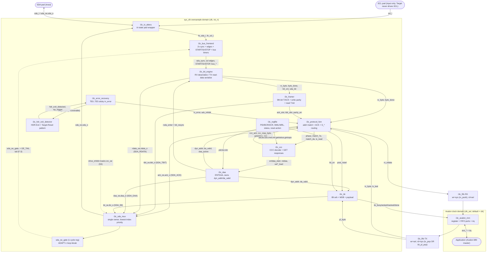

> Notes grounded in `rtl/i3c_target_top.sv`: the TX FIFO read port is **shared (N-5)**
> between the private-read pop (`pf_tx_pop`) and the IBI payload pop (`ibi_pl_pop`).
> The mux mask is `if (err_drive_inhibit) src_oe = '0;`. `SDA_DBG` is tied `0/0`.
> Under `FORMAL` the pad is replaced by an abstract wired-AND bus (see §5).

---

## 2. Clocking / CDC

The Target treats SDA/SCL as **asynchronous inputs** and runs all logic on a single
free-running `sys_clk` (`clk`). This flowchart traces the only async crossing — the
`SYNC_STAGES` (=2) FF synchronizers in `i3c_bus_frontend` — into 1-cycle **edge
strobes** that drive the entire `sys_clk` core (which never uses SCL as a clock), and
the optional Avalon-clock boundary selected by `clk_avl = AVL_ASYNC ? avl_clk : clk`
(default `AVL_ASYNC = 0`, so `avl_clk` is tied to `clk` and the FIFOs are wired
single-clock, `ASYNC = 0`).

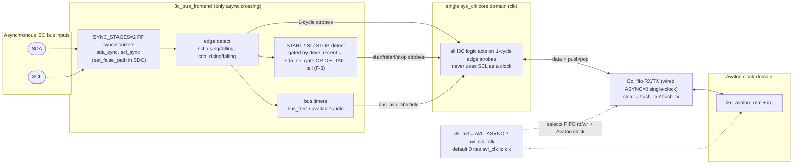

> CDC note (`i3c_bus_frontend.sv`): metastability on `sda_sync`/`scl_sync` is closed by
> SDC (`set_false_path`) plus the ≥3-sample rule, **not** by formal; upper layers are
> proven against the idealized edge strobes. The `i3c_fifo` block supports an
> async (Gray-pointer) mode (`ASYNC=1`), but the top instantiates both FIFOs with
> `ASYNC=0`.

---

## 3. FSM state diagrams

### 3.1 `i3c_protocol_fsm` (state_e)

Top SDR sequencer: arms address capture on (R)START, matches `7'h7E` / the dynamic
address, drives the open-drain address ACK, and routes the frame to write / read /
CCC / DAA. States and guards are the `state_e` enum and the `next_state` case in
`rtl/i3c_protocol_fsm.sv`.

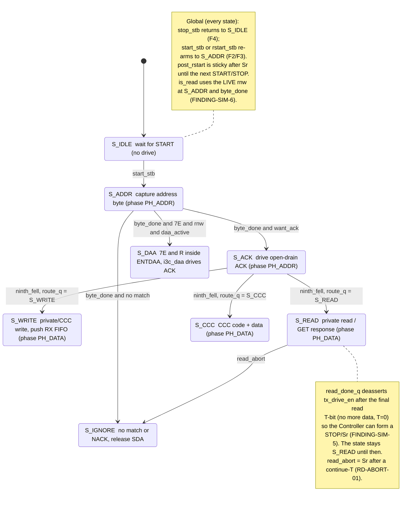

### 3.2 `i3c_daa` (DAA round FSM)

ENTDAA participation (only when `!da_valid`, [C8]), 64-bit `{PID,BCR,DCR}` open-drain
arbitration, DA + odd-parity PAR capture, ACK/latch or NACK/re-arm. States are the
`S_*` localparams and the round-FSM case in `rtl/i3c_daa.sv`. The `rxda_enter` pulse
drives the bit engine's `bit_resync` when entering `S_RXDA` so the shared 9-bit
framing re-aligns after the non-multiple-of-9 payload (FINDING-SIM-3).

```mermaid
stateDiagram-v2
  [*] --> S_IDLE
  S_IDLE : S_IDLE  not in a round
  S_HDR : S_HDR  await Sr+7E/R header (participating)
  S_ACK7E : S_ACK7E  drive ACK Low for 7E/R
  S_PLD : S_PLD  drive 64-bit PID,BCR,DCR MSb-first, arbitrate
  S_RXDA : S_RXDA  receive assigned DA + PAR byte
  S_ACKDA : S_ACKDA  ACK+latch DA (parity ok) or NACK
  S_WAIT : S_WAIT  passive (lost / done / TE4), await STOP

  S_IDLE --> S_HDR : entdaa_start and not da_valid
  S_IDLE --> S_WAIT : entdaa_start and da_valid
  S_HDR --> S_ACK7E : byte_done and rx_byte == 0xFD
  S_HDR --> S_WAIT : byte_done and not 7E/R header (TE4)
  S_ACK7E --> S_PLD : scl_rising
  S_PLD --> S_PLD : scl_rising, payload_idx below 63
  S_PLD --> S_RXDA : scl_rising and payload_idx == 63
  S_PLD --> S_WAIT : arb_lost or rstart_stb
  S_RXDA --> S_ACKDA : byte_done
  S_ACKDA --> S_WAIT : scl_rising and parity_ok
  S_ACKDA --> S_HDR : scl_rising and not parity_ok
  note right of S_PLD
    Per bit: drive Low for a 0, release for a 1; a released 1
    sampled as 0 is arb_lost (released-1 sampled-0 -> S_WAIT).
    On entering S_RXDA, rxda_enter pulses bit_resync (FINDING-SIM-3).
  end note
  note left of S_IDLE
    Global: stop_stb returns to S_IDLE from any phase (clean
    abort, DAA-ABORT-01); whole_reset also returns to S_IDLE.
    daa_o is tied 0 (open-drain only, R-DAA-07).
  end note
```

### 3.3 `i3c_ibi` (IBI engine FSM)

Gated request (`capable = bcr[1] and ibi_en and ibi_en_app and da_valid`), open-drain
header arbitration of `{dyn_addr, RnW=1}`, ACK/NACK sampling, then push-pull MDB +
optional payload with End-of-Data T-bits. States are the `ST_*` localparams and main
case in `rtl/i3c_ibi.sv` (`bcr[2]` = MDB present).

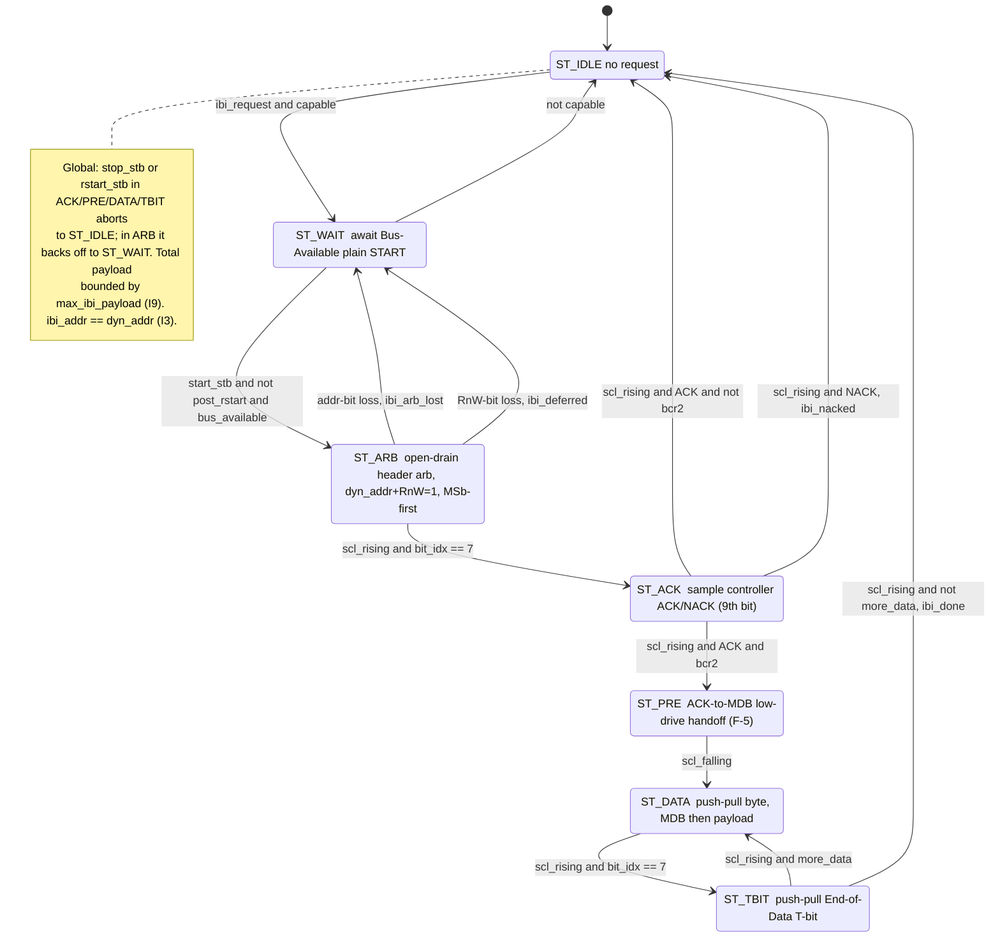

### 3.4 `i3c_error_recovery` (sticky in_error + recovery class)

Not a free-running FSM but a sticky `in_error` flag with a latched recovery **class**
(`recov_class`) that selects which bus event clears it (`clear_event` in
`rtl/i3c_error_recovery.sv`). While in error, both `ack_inhibit` and `drive_inhibit`
are asserted (E3/S3) and every `te*_event` pulses `proto_err_set`.

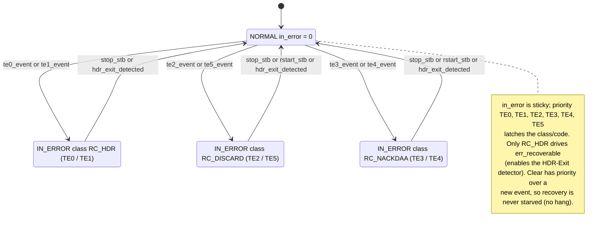

> Companion `i3c_hdr_exit_detector` is a shared SDA-transition counter (not a
> multi-state FSM): 4 SDA falls with SCL Low → `hdr_exit_detected`; 14 transitions
> ending SDA-High → `trp_body_valid`; then `body → Sr → STOP` → `trp_trigger`
> (drives the Target-Reset escalation glue in `i3c_target_top`).

---

## 4. Transaction sequence diagrams

Participants are **Controller**, the **SDA bus** (abstract wired-AND with pull-up),
the **Target core**, and the **Application** (Avalon-MM). Bit/byte ordering follows
the RTL: SDA sampled on SCL rising, MSb-first; the 9th bit is an ACK in `PH_ADDR` and
a T-bit in `PH_DATA`.

### 4.1 Dynamic Address Assignment via ENTDAA

Includes the 64-bit open-drain payload, the `rxda_enter`/`bit_resync` re-frame, and
the assigned-DA + odd-parity PAR capture.

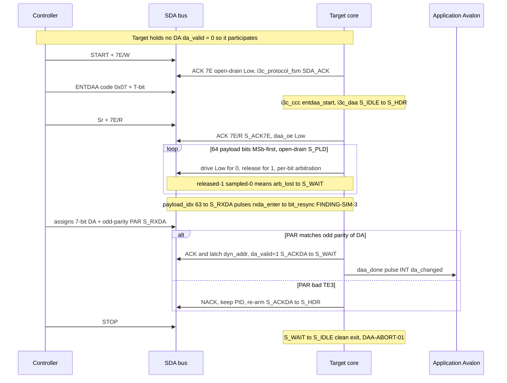

### 4.2 SDR private write (Controller to Target)

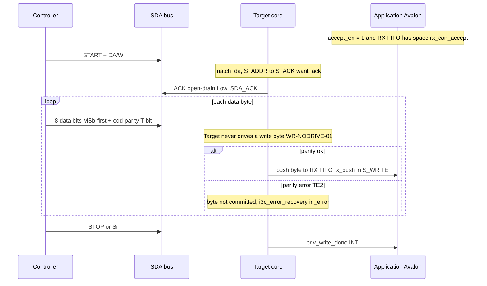

### 4.3 SDR private read with T-bit (Target to Controller)

Includes the `tx_first` MSb hold (FINDING-SIM-4) and the `read_done_q` termination
(FINDING-SIM-5).

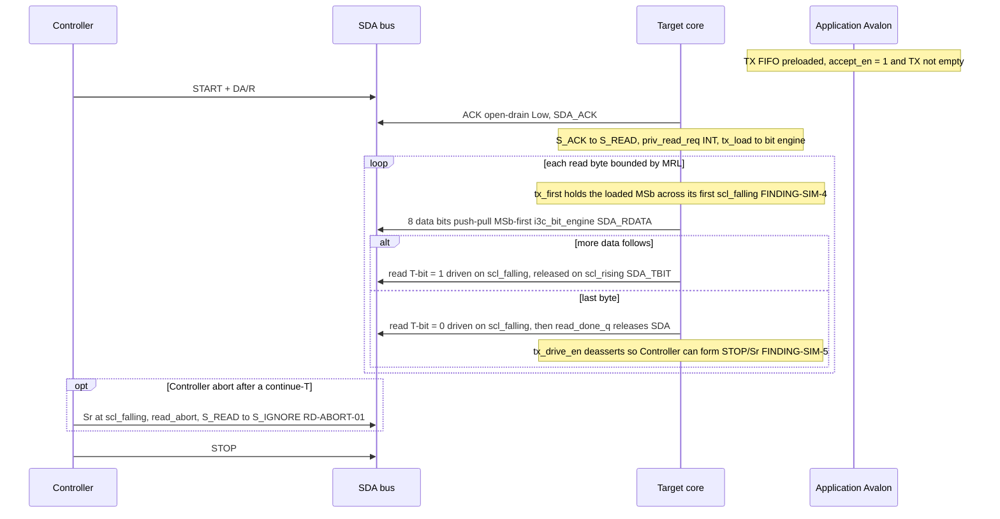

### 4.4 Direct CCC: GETSTATUS (Format-1)

7E+W, code, Sr, DA+R with `is_read` driven live (FINDING-SIM-6), then the FIFO-bypassed
response. The B-1 bypass means the directed-GET ACK is **not** gated by
`accept_en`/FIFO/pending-error, so the mandatory status read never deadlocks.

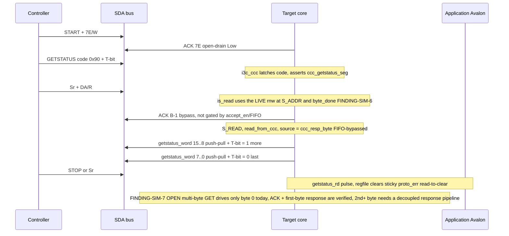

### 4.5 In-Band Interrupt (IBI) with arbitration + MDB

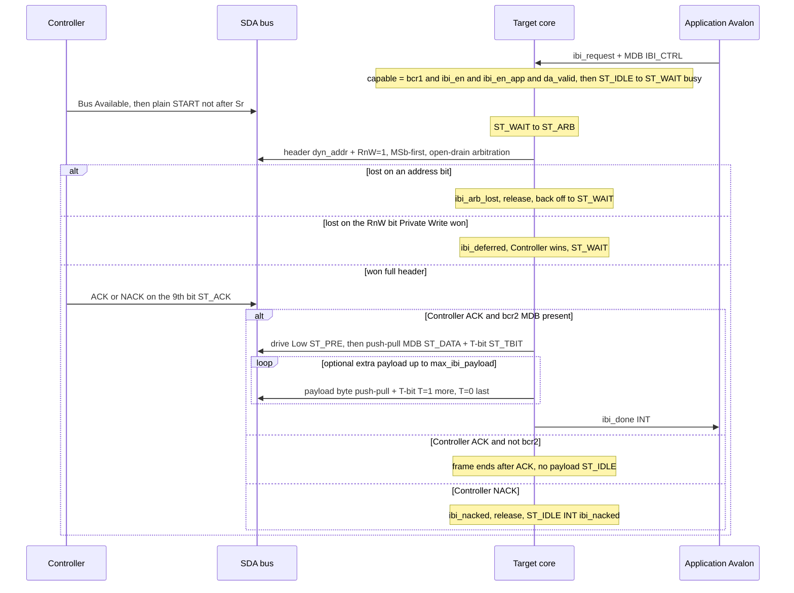

---

## 5. SDA drive-ownership & contention

Every internal SDA driver exposes an `(oe, o)` request pair; all feed the single
`i3c_sda_mux`, masked by `drive_inhibit` (S3). The resolved `(sda_oe, sda_o)` is the
only signal reaching the pad; a **registered** copy (`sda_oe_gate`, ADAPT-1) extended
by `OE_TAIL` (=4) cycles feeds the front-end's F-3 gate so the Target never mistakes
its own drive (or its pull-up release transient, FINDING-SIM-1) for a bus condition.
On the bus the line resolves wired-AND against the pull-up and a free Controller
driver. The integration safety properties in `rtl/i3c_target_top.sv` are annotated:
**F-1** (contention monitor), **F-2** (`onehot0(f_src_req)`, single owner) and **F-3**
(self-drive gate, also `a_f3_top`).

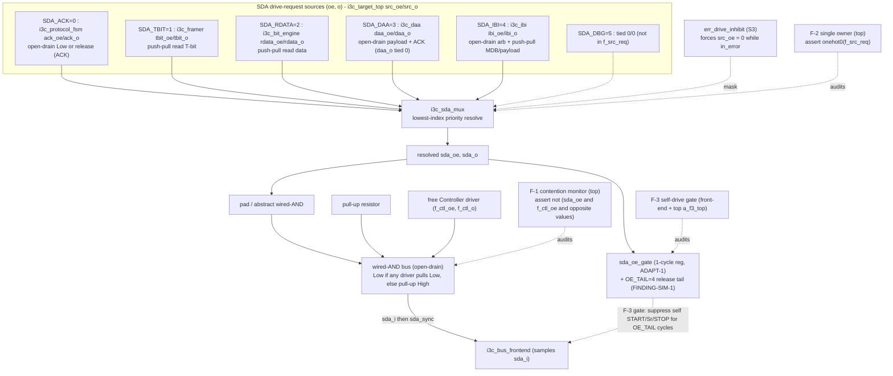

> Grounded in the `FORMAL` block of `rtl/i3c_target_top.sv`:
> `f_src_req = {ibi_oe, daa_oe, be_rdata_oe, fr_tbit_oe, pf_ack_oe}` (5 bits; `SDA_DBG`
> excluded). `a_contention = !(sda_oe && f_ctl_oe && (sda_o != f_ctl_o))` (F-1),
> `a_single_owner = $onehot0(f_src_req)` (F-2), `a_f3_top = !sda_oe ||
> !(start_stb || rstart_stb || stop_stb)`. Controller-environment assumes CA1/CA2/CA3
> keep a legal Controller released during the Target's push-pull read and active IBI,
> and never hard-High while the Target pulls open-drain Low.
