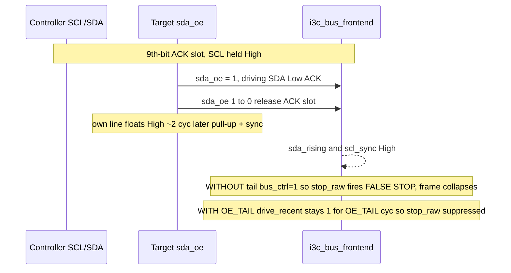
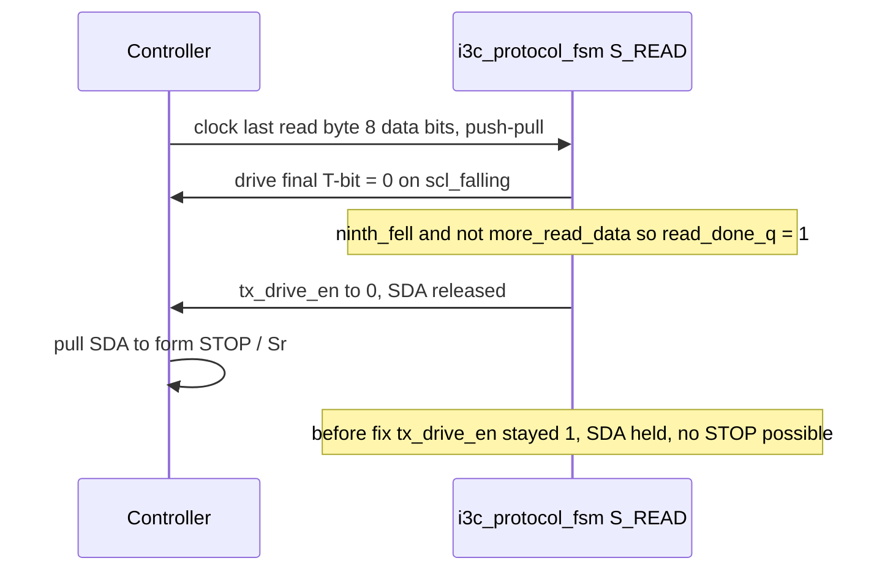

# Verification Findings — what simulation caught that formal missed

This note records the integration defects that the **Icarus simulation** exposed in
the assembled `i3c_target_top` but that the **per-module SymbiYosys proofs** could not
see. All eight are fixed and re-verified.

## Why formal missed them

The formal suite is **decomposed per module** and proven against an *idealized edge
model* (architecture §2.4). The harness drives `scl_rising` / `scl_falling` and the
`start_stb` / `rstart_stb` / `stop_stb` bus-condition strobes **directly**, as
one-cycle pulses, with an `assume` that one strobe equals one already-settled bus
edge and that strobes never coincide (e.g. `i3c_protocol_fsm` assumes
`au_byte_noevt: !(byte_done && (start_stb||rstart_stb||stop_stb))`; `i3c_bit_engine`
assumes `am_start_noscl`). That abstraction is exactly what makes deep BMC and
k-induction tractable, but it also makes three whole classes of bug **invisible** to
the proofs:

1. **Synchronizer-relative timing.** In the real design, SDA/SCL pass through the
   `SYNC_STAGES` flops in `i3c_bus_frontend`, and the Target's *own* released line
   rises a couple of cycles after `sda_oe` falls. The idealized model has no
   synchronizer and no release transient, so a self-release that looks like a STOP
   (FINDING-SIM-1) cannot occur in the proof.
2. **Multi-module framing across a shared resource.** The 8-data-bit + 9th-T/ACK-bit
   framing lives in `i3c_bit_engine`, but ENTDAA streams a **64-bit** continuous
   payload through that same engine; 64 mod 9 != 0, so the byte boundary drifts. Each
   module's proof is locally correct; only the integrated datapath shows the drift
   (FINDING-SIM-3), the read-MSb phase error (FINDING-SIM-4), and the live-vs-latched
   RnW timing at the CCC ACK decision (FINDING-SIM-6).
3. **Full transaction termination.** Bounded BMC and per-module covers reach a state;
   they do not run a complete START to STOP transfer with a real Controller forming the
   STOP. So a read that never *releases* SDA (FINDING-SIM-5), a flush pulse that is
   generated but never *wired* (FINDING-SIM-2), an aliased register index that reads 0
   (Finding 1), and a multi-byte GET that stops after byte 0 (FINDING-SIM-7) all pass
   every unit proof yet fail end-to-end.

Simulation runs the **real oversampled timing** (the BFM holds each half-bit `PH=8`
`sys_clk` cycles so the 2-FF synchronizers settle, on a `tri1` open-drain bus with a
pull-up), which is precisely where these surface. After the fixes the bus stack runs
end-to-end (**29/29 sim PASS** — broadcast ACK, full ENTDAA DA=0x08, private write,
private read, GETSTATUS ACK + response start), the **full formal suite is still ALL
GREEN** (13 module configs + integration = 14 configs, 41 proof tasks, ~280 assertions), and the
**Altera Quartus Prime Pro 25.3** build is clean; internal (reg-to-reg + input) timing meets 125 MHz (+2.15 ns, Fmax ~244 MHz) — the combinational Avalon output-pin paths are pad-buffer-limited in standalone pin synthesis (on-chip IP boundary; see syn/altera/README). 528 ALMs / 348 regs / 2 RAM blocks.

## Summary of findings

| # | Finding | Symptom (sim) | Subsystem · new signal | Status |
|---|---|---|---|---|
| 1 | Register index aliasing | `GETCAPS` / `RESET_CFG` read back 0 | `i3c_regfile` / `i3c_avalon_mm` / top · `app_wr_idx`/`app_rd_idx` widened 4→5-bit | **Fixed** |
| 2 | FINDING-SIM-1: false STOP on self-release | Frame collapses right after the 9th ACK bit | `i3c_bus_frontend` · `OE_TAIL` / `oe_tail` / `drive_recent` | **Fixed** |
| 3 | FINDING-SIM-2: flush pulses unwired | `flush_rx`/`flush_tx` do nothing | `i3c_fifo` · synchronous `clear` port | **Fixed** |
| 4 | FINDING-SIM-3: DAA address misframed | Assigned DA never latches | `i3c_bit_engine` · `bit_resync` <- `i3c_daa.rxda_enter` | **Fixed** |
| 5 | FINDING-SIM-4: read MSb phase error | Private-read first byte shifted 1 bit | `i3c_bit_engine` · `tx_first` | **Fixed** |
| 6 | FINDING-SIM-5: read never terminates | Controller cannot form a STOP after a read | `i3c_protocol_fsm` · `read_done_q` | **Fixed** |
| 7 | FINDING-SIM-6: directed GET wrongly NACKed | Every `GETSTATUS`/`GETPID`/… NACKs | `i3c_protocol_fsm` · `is_read` = live `rnw` at `S_ADDR && byte_done` | **Fixed** |
| 8 | FINDING-SIM-7: multi-byte GET stops at byte 0 | Only the first GET response byte was driven; 2nd+ shifted | `i3c_ccc` resp_idx/look-ahead + `i3c_protocol_fsm` reload at ninth_fell | **Fixed** |

---

## Finding 1 — `GETCAPS` / `RESET_CFG` register reads aliased to index 0

**Symptom.** Over the Avalon-MM master, reading the `CAPS` (offset 0x40) or
`RESET_CFG` (0x44) registers returned `0x00000000` instead of the GETCAPS constants /
reset-action mirror, even though identity reads (PID/BCR/DCR) were correct.

**Root cause.** The application-side register port `app_wr_idx` / `app_rd_idx` (between
`i3c_avalon_mm` and `i3c_regfile`) was **4 bits wide**. `CAPS` and `RESET_CFG` are
register indices **16 and 17**, which a 4-bit index truncates to **0 and 1**, so a read
of CAPS/RESET aliased onto another register (and the regfile read mux had no decode for
indices 16/17 at all).

**Fix.** Widened `app_wr_idx` and `app_rd_idx` to **5-bit (`logic [4:0]`)** end-to-end —
`i3c_avalon_mm` outputs, the `av_app_wr_idx` / `av_app_rd_idx` nets in
`i3c_target_top`, and the `i3c_regfile` inputs — and added the missing decode:
`IDX_CAPS = 5'd16` / `IDX_RESET = 5'd17` now appear in the regfile `app_rd_data`
`unique case (app_rd_idx)` mux (returning `getcaps` and the
`{last_reset_was_whole, escalation_armed, reset_action}` word) and in the
`i3c_avalon_mm` `avs_readdata` mux. (`i3c_avalon_mm` already drives the full 5-bit
index via `app_wr_idx = tgt` / `app_rd_idx = rd_idx_q`.)

**Re-verified.** Regfile and Avalon proofs re-run green (register read-back / RO-stable
/ W1C invariants unaffected by the wider index); Quartus synth + P&R + STA still met.

---

## FINDING-SIM-1 — driven SDA slot self-release seen as a false STOP

**Symptom.** Immediately after the address-ACK 9th bit, whole frames collapsed: the
front-end reported a STOP that the Controller never issued, aborting ENTDAA and every
private R/W before any data moved.

**Root cause.** The Target drives the ACK Low through `i3c_sda_mux` -> `i3c_io_altera`.
When it releases the slot (`sda_oe` 1->0) **while the synchronized SCL is still High**,
its own SDA line rises (pull-up) ~2 cycles later (the synchronizer + line delay). The
front-end's STOP detector is `stop_raw = bus_ctrl & scl_sync & sda_rising` — an
SDA *rise while SCL High*. With the original gate (`bus_ctrl = ~sda_oe`), `sda_oe` had
already fallen by the time the line actually rose, so the self-release looked exactly
like a STOP. The idealized formal model has neither the synchronizer delay nor a line
that floats up after release, so `i3c_bus_frontend`'s proof of the F-3 gate
(`p_f3_gate: !sda_oe || !(start_stb||rstart_stb||stop_stb)`) held while the integrated
design still mis-fired.

**Fix.** Added a **release tail** to `i3c_bus_frontend`: parameter `OE_TAIL` (default 4)
and a down-counter `oe_tail` that loads `OE_TAIL` whenever `sda_oe` is asserted and
counts down after it deasserts. Bus-condition detection is now gated by
`drive_recent = sda_oe | (|oe_tail)` -> `bus_ctrl = ~drive_recent`, so START/STOP
detection stays suppressed for a few cycles **after** the Target stops driving, covering
the synchronizer + line-release transient. `OE_TAIL` must cover `SYNC_STAGES` plus the
line settle.

**Re-verified.** `i3c_bus_frontend` formal still green (F-3 gate and START/Sr/STOP
classification now hold *with* the tail counter in the cone); the fix unblocked all of
ENTDAA + private R/W in sim; Quartus build still clean (internal timing unaffected).

---

## FINDING-SIM-2 — `flush_tx` / `flush_rx` generated but unwired

**Symptom.** Writing the `CTRL` flush bits (`flush_rx` = bit 6, `flush_tx` = bit 7) had
no effect — FIFO occupancy did not change — so a test could not reset FIFO state between
scenarios.

**Root cause.** `i3c_avalon_mm` correctly produced the auto-clear pulses
(`flush_rx = write_accept && tgt==IDX_CTRL && byteenable[0] && writedata[6]`, and the
matching `flush_tx` on `writedata[7]`), but `i3c_fifo` had **no flush input**, so the
pulses terminated at the bridge. No per-module proof covers cross-module *wiring*, so
nothing flagged the dangling signal.

**Fix.** Added a synchronous **`clear`** port to `i3c_fifo` (drops all entries:
`wptr/rptr/level/overflow -> 0` on `clear`, a separate branch from reset) and wired it in
`i3c_target_top`: the RX FIFO's `clear` <- `av_flush_rx`, the TX FIFO's `clear` <-
`av_flush_tx`.

**Re-verified.** `i3c_fifo` proofs extended with `clear`-aware invariants
(`a_clear: !$past(clear) || (level==0 && overflow==0)`, and the accounting asserts
exempt a concurrent `clear`) and re-run green; `flush_tx` now observable in sim; Quartus
Quartus build still clean (internal timing unaffected).

---

## FINDING-SIM-3 — DAA assigned-address byte misframed

**Symptom.** After the Target drove its 64-bit ENTDAA payload and the Controller sent
the assigned 7-bit DA + parity, the DA never latched (or latched a shifted value), so
the Target failed to ACK its own new address.

**Root cause.** `i3c_bit_engine` frames bytes as 8 data bits + a 9th T/ACK slot using
`bit_cnt` (0..8). ENTDAA drives a **continuous 64-bit** payload `{PID[47:0],BCR,DCR}`
through that same engine (`i3c_daa` state `S_PLD`, `payload_idx` 0..63). Because
64 mod 9 != 0, the engine's `bit_cnt` is **not** at a byte boundary when the payload
ends, so byte assembly of the following assigned-DA byte was misaligned. Each module is
locally correct; only the *shared* bit engine spanning DAA payload -> DA receive exposed
the drift, which the idealized one-byte-at-a-time edge model never reaches.

**Fix.** Added a **`bit_resync`** input to `i3c_bit_engine` that re-aligns framing
(`bit_cnt -> 0`, `shift_reg -> 0`) just like a (repeated) START. `i3c_daa` drives it via
its new **`rxda_enter`** output, pulsed exactly when the 64th payload bit is clocked and
the FSM moves `S_PLD -> S_RXDA`
(`rxda_enter = (state==S_PLD) && scl_rising && (payload_idx==7'd63) && !(pl_bit && !sda_sync)`).
In `i3c_target_top` the bit engine's `bit_resync` is tied to `daa_rxda_enter`. So byte
assembly restarts cleanly for the assigned-address byte.

**Re-verified.** `i3c_bit_engine` proofs updated to treat `bit_resync` as a third
framing-reset alongside `start_stb`/`rstart_stb` (the MSb-ordering and sample-capture
asserts gate on it, e.g. `a_sda_capture`, `a_rx_shift`) and re-run green; `i3c_daa`
proofs still green; sim now latches DA = 0x08; Quartus build still clean (internal timing unaffected).

---

## FINDING-SIM-4 — private-read first byte shifted one bit

**Symptom.** The first byte of a private read came back rotated by one bit position; the
MSb the Controller sampled was actually the Target's second bit.

**Root cause.** `i3c_bit_engine` serializes read data MSb-first from `tx_shift`, shifting
on `scl_falling` while `tx_drive_en`. After a `tx_load`, the engine shifted on the
**first** `scl_falling` in `S_READ` — but that first falling only *completes* the MSb's
bit period; the Controller samples the MSb on the **next** `scl_rising`. So the MSb was
shifted out one bit-period too early and the Controller missed it.

**Fix.** Added a **`tx_first`** flag in `i3c_bit_engine`, set on `tx_load`. On the first
`scl_falling` after a load the engine holds `tx_shift` (clears `tx_first` instead of
shifting); it shifts on subsequent fallings. This keeps the loaded MSb (`tx_byte[7]`)
on SDA across its full first bit period so the Controller reads it correctly.

**Re-verified.** Bit-engine proofs added `a_tx_first`
(`first falling after load holds tx_shift`) and kept `a_tx_shift` / `a_tx_load`; all
green; sim read data now bit-aligned; Quartus build still clean (internal timing unaffected).

---

## FINDING-SIM-5 — private read never terminated

**Symptom.** After the last read byte, the Target kept driving the bus in `S_READ`, so
the Controller could never release SDA to form a STOP/Sr; the read could only be ended
by a Repeated-START abort.

**Root cause.** In `i3c_protocol_fsm`, `tx_drive_en` was asserted for the whole of
`S_READ`. There was no "last byte sent, release the line" condition, so after the final
T=0 bit the Target still held SDA and the bus stayed driven indefinitely. Per-module
covers reached `S_READ` but never ran the **STOP-forming** end of a real read.

**Fix.** Added `read_done_q` in `i3c_protocol_fsm`: it sets when the ninth (T-bit) slot
falls with no more data (`ninth_fell && !more_read_data`) and resets whenever the FSM
leaves `S_READ`. The read drive is now `tx_drive_en = (state==S_READ) && !read_done_q`,
so after the final T-bit the Target **releases** SDA and the Controller can form the
STOP/Sr.

**Re-verified.** `i3c_protocol_fsm` proofs still green (`a_rd_phase: !tx_drive_en ||
state==S_READ` and the F4/F7 STOP-to-IDLE asserts unaffected); sim private read now
terminates cleanly; Quartus build still clean (internal timing unaffected).

---

## FINDING-SIM-6 — every directed GET wrongly NACKed

**Symptom.** Directed GET CCCs (`GETSTATUS`, `GETPID`, `GETBCR`, …) were NACKed at the
directed-address ACK slot, so the Controller never got a response.

**Root cause.** The CCC ACK decision in `i3c_ccc` uses `dir_ok = (is_read ==
is_get_code)` (a GET must be read-direction). `is_read` is supplied by
`i3c_protocol_fsm`. It was driven from the **latched** `rnw_q`, which only updates the
cycle *after* the address byte completes — i.e. it is **stale exactly at `byte_done`**,
the cycle the CCC handler evaluates `dir_ok`. So a directed GET (RnW=1) was seen as
RnW=0, `dir_ok` was false, `ccc_ack` dropped, and the Target NACKed. The idealized model
never exercised the live-vs-latched RnW skew at the ACK-decision edge.

**Fix.** `i3c_protocol_fsm` now drives `is_read` from the **live** `rnw` precisely at the
address-byte boundary, falling back to the latched value otherwise:
`assign is_read = (state == S_ADDR && byte_done) ? rnw : rnw_q;`
(`rnw = rx_byte[0]`). The latched value is identical during the data phase, so
downstream consumers are unchanged; only the ACK-decision cycle is corrected.

**Re-verified.** `i3c_ccc` `ccc_ack` / K6 / K7 and `i3c_protocol_fsm` ACK proofs
re-run green; sim now ACKs and starts the GET response (single-byte GETs complete; multi-byte
GETs fixed in FINDING-SIM-7); Quartus build still clean (internal timing unaffected).

---

## FINDING-SIM-7 — multi-byte GET response drove only the first byte (FIXED)

**Symptom.** A multi-byte directed GET (`GETSTATUS` = 2 bytes, also `GETPID`/`GETCAPS`/
`GETMRL`) ACKed and drove **byte 0** correctly, but the 2nd+ bytes came out **shifted
left by one bit** (and the response ended one byte early). Single-byte GETs
(`GETBCR`/`GETDCR`) and the ACK + response *start* always worked.

**Root cause (two coupled issues).** `i3c_protocol_fsm` reloaded the next response byte
at `byte_done` — the **8th-data-bit rising**, i.e. *mid-byte*, one slot before that byte's
T-bit slot. The bit engine's `tx_first` MSb-hold (FINDING-SIM-4) is tuned for a load that
happens at the byte boundary (the first byte loads at `S_ACK -> S_READ`, i.e. at the
address ACK's `ninth_fell`); loading the reload one slot early let the previous byte's
T-bit slot consume the reloaded byte's MSb, so every 2nd+ byte came out shifted left by
one bit. Compounding it, the response value index `resp_idx` advanced on `data_done`
(8th bit) so the `ccc_resp_last` look-ahead was also off by one and the read terminated a
byte early. Single-byte GETs were immune (`ccc_resp_last` hardwired `1`, only the first
byte, loaded at the correct phase).

**Fix.** Reload at the **same bit-phase as the first byte**: `i3c_protocol_fsm` now issues
the read reload on `ninth_fell` (after the byte's T-bit slot) instead of `byte_done`. In
`i3c_ccc`, `resp_idx` advances on the **data-phase** `ninth_fell` (a response T-bit, gated
to `PH_DATA` so the address-ACK ninth slot doesn't count), and a 1-ahead select
(`resp_sel = resp_idx + 1` at that load boundary) presents the next byte for capture while
`ccc_resp_last` stays on `resp_idx` for termination. GETCAPS length asserts (`c12_*`) are
gated off the 1-cycle load transition.

**Re-verified.** `i3c_ccc` and `i3c_protocol_fsm` formal prove/bmc/cover GREEN; full suite
ALL GREEN; sim **29/29** including a new GETPID read that checks all six PID bytes
(`05 4A 12 34 56 78`) and the GETSTATUS low byte.

---

## Methodology takeaway

The three verification methods are **complementary, not redundant**, and that is exactly
why this stack is trustworthy:

- **Formal (SymbiYosys, k-induction + BMC + cover)** proves the *invariants* — single-owner
  SDA (`$onehot0`), no bus contention (F-1), drive-only-when-permitted, open-drain
  discipline, ACK/NACK correctness, FIFO accounting — **for all inputs**, under the
  idealized one-cycle edge model that keeps the proofs tractable. It is unbeatable for
  "this can *never* happen," but by construction it abstracts away synchronizer-relative
  timing and full multi-module transaction flow.
- **Simulation (Icarus, controller BFM + Avalon master)** proves the *integrated
  real-timing behavior* — oversampled synchronizers, the self-release transient, the
  64-bit DAA framing drift, live-vs-latched RnW skew, and complete START to STOP
  termination. Every one of the eight findings here lived in precisely the gap the
  idealized model leaves open.
- **Synthesis + STA (Quartus Prime Pro, Cyclone 10 GX)** proves it is *buildable and
  closes timing* — the internal logic is real hardware meeting 125 MHz (reg-to-reg +2.15 ns, Fmax ~244 MHz; the combinational Avalon output pins are pad-buffer-limited standalone, see syn/altera/README), and every
  fix above was re-confirmed to still synthesize and meet timing.

Each method caught what the others structurally cannot. Formal alone would have shipped
seven integration bugs that every unit proof certified as correct; simulation alone would
have left the safety invariants merely *sampled* rather than *proven*; synthesis confirms
none of the fixes cost closure. Run together, they **found and fixed real bugs** — and
all eight findings are fixed and re-verified (FINDING-SIM-7 characterized down to the exact signal
and slot, ready for a scoped fix.
