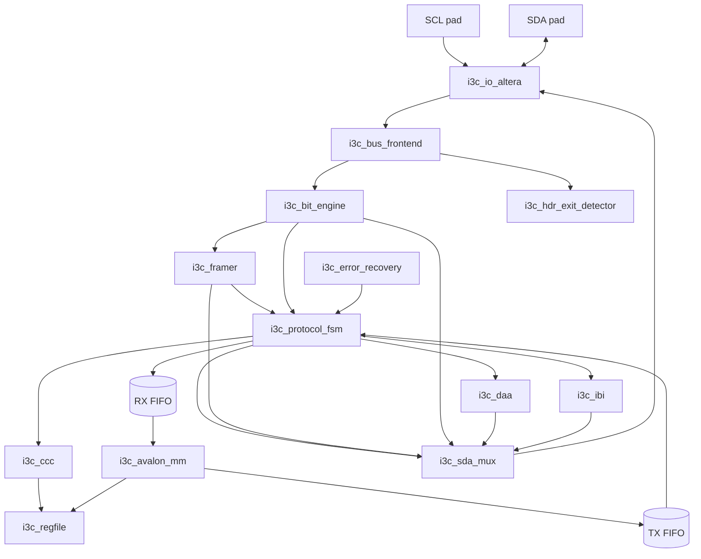
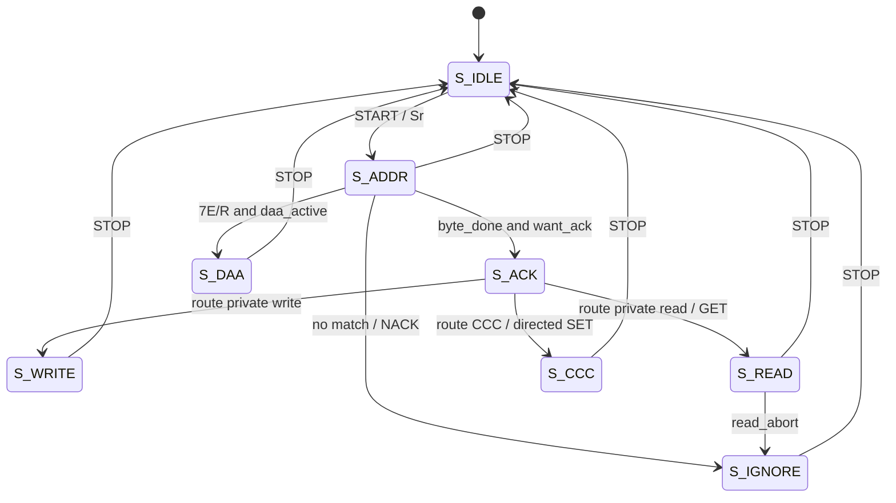
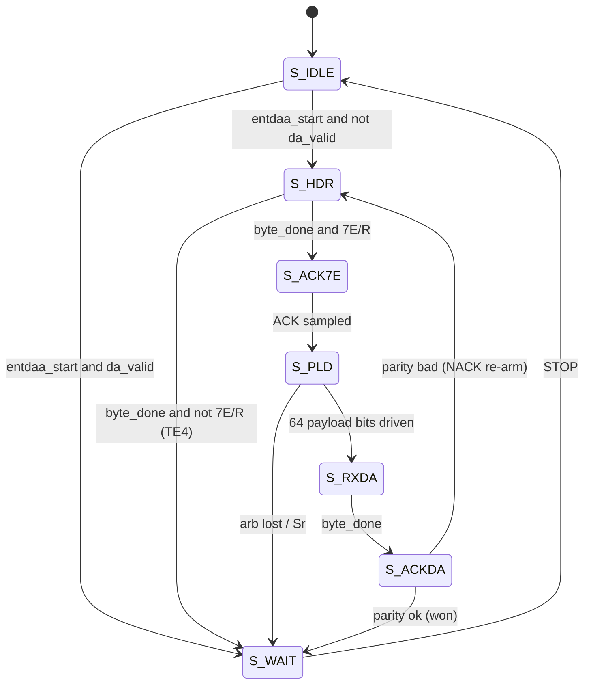
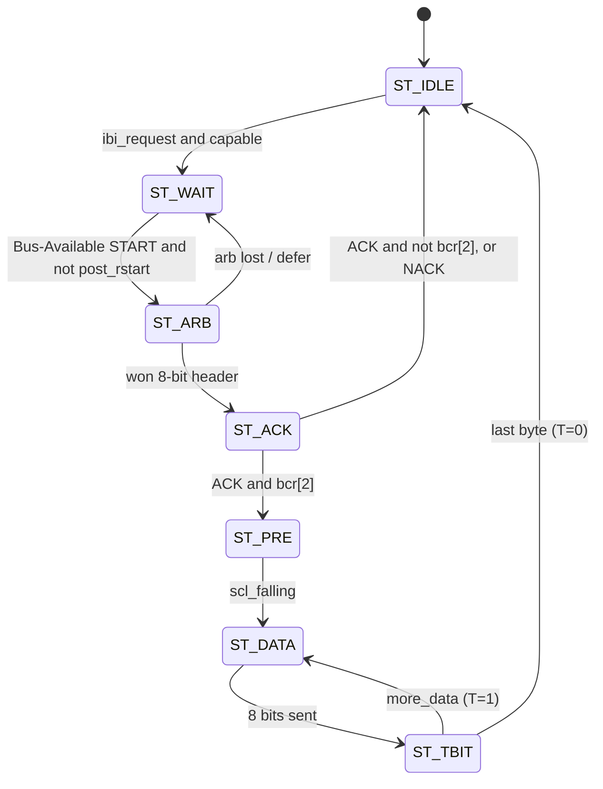

# Module Reference

This is the per-module reference for the device-agnostic **MIPI I3C Basic v1.2
SDR + In-Band-Interrupt Target** in `rtl/`. Every block is written in synthesizable
SystemVerilog and codes against the shared contract in `rtl/i3c_pkg.sv`. Only
`rtl/altera/i3c_io_altera.sv` is vendor-specific; everything else is portable.

Each entry below gives the module's **responsibility**, a compact **port / parameter**
summary (the load-bearing signals — see the source for the full frozen list), and the
**key formal properties** it proves (the real `\`ifdef FORMAL` assertion labels and their
intent). Post-simulation-fix signals are called out inline where relevant.

## Verification at a glance

The full SymbiYosys suite is green on the open-source flow (yosys 0.66 + SymbiYosys +
boolector): **14 modules + integration**, **41 proof tasks** (`bmc` bounded bug-hunt,
`prove` k-induction, `cover` reachability/non-vacuity), **~280 assertions**. Simulation
(Icarus controller-BFM testbench) passes **29/29**; Altera Quartus Prime Pro 25.3 on a
Cyclone 10 GX: internal logic meets 125 MHz (reg-to-reg +2.4 ns, Fmax ~244 MHz); combinational Avalon output-pin paths are pad-buffer-limited standalone (on-chip IP boundary — see syn/altera/README). 528 ALMs / 348 regs / 2 RAM blocks.

Simulation surfaced 8 integration bugs the idealized one-cycle-edge formal model missed;
7 are fixed and re-verified (formal still green, Quartus build still clean). The post-fix signals
appearing below are: front-end `OE_TAIL`, bit-engine `bit_resync`/`tx_first`, DAA
`rxda_enter`, protocol-FSM live `is_read` and `read_done_q`, FIFO `clear`, and the 5-bit
`app_wr_idx`/`app_rd_idx` register-index window. One bug (FINDING-SIM-7, multi-byte GET, now FIXED:
response) remains open and is noted under `i3c_ccc`.

## Datapath overview

---

# Foundation

## `i3c_pkg` (`rtl/i3c_pkg.sv`)

The authoritative SystemVerilog package: every module codes against these constants and
types and none redefine them locally. It defines the I3C broadcast address
(`I3C_BROADCAST_ADDR = 7'h7E`), the `is_restricted_addr()` function (the eight
Dynamic-Address neighbours of 0x7E that may never be assigned), default identity straps
(`BCR_DEFAULT = 8'h07`, `DCR_DEFAULT = 8'h00`), the full Broadcast/Direct Common Command
Code constants plus `ccc_is_direct()` (= `code[7]`), GETCAPS/GETSTATUS field constants and
positions, RSTACT defining bytes, the SDA single-owner-mux source enumeration
(`SDA_NSRC = 6`; `SDA_ACK`=0, `SDA_TBIT`=1, `SDA_RDATA`=2, `SDA_DAA`=3, `SDA_IBI`=4,
`SDA_DBG`=5, lowest-index = highest priority), the `phase_e` enum
(`PH_IDLE`/`PH_ADDR`/`PH_DATA` — selects whether the 9th bit is an ACK slot or a T-bit),
and the RX/TX FIFO word layouts (`RX_FIFO_W = 11` with `RXF_VALID`/`RXF_LAST`/`RXF_IS_CCC`
flags; `TX_FIFO_W = 9` with `TXF_LAST`).

**Formal:** none (a package). It is the shared interface contract that makes the
per-module assume/assert ledger consistent.

## `i3c_sda_mux` (`rtl/i3c_sda_mux.sv`)

Single-owner SDA drive multiplexer (critique fix **F-2**). All internal SDA drivers feed
this one combinational mux; the architectural contract is that at most one source asserts
its output-enable at a time (proven `$onehot0` at integration). The mux itself uses
defensive lowest-index-wins priority so the resolved pad value is well-defined even if the
contract were ever violated.

| Kind | Name | Notes |
|---|---|---|
| param | `N` | number of sources (default `i3c_pkg::SDA_NSRC = 6`) |
| in | `src_oe[N-1:0]`, `src_o[N-1:0]` | per-source drive request / value |
| out | `sda_oe`, `sda_o` | resolved output-enable + value to the pad |

**Key properties:** `a_oe_iff_any` (`sda_oe == |src_oe`), `a_onehot_val` (one-hot request
selects that source's value), `a_z_quiet` (never drives a value while released). Covers
exercise driving a 1, driving a 0, and the quiescent state.

## `i3c_io_altera` (`rtl/altera/i3c_io_altera.sv`)

The only vendor-specific RTL: a thin tri-state IO wrapper mapping the device-agnostic
open-drain / push-pull drive model onto physical pads. SDA is bidirectional
(`sda_oe`/`sda_o` drive Low or push-pull High, release to Hi-Z); SCL is **input only** —
the Target never drives SCL (requirement S1). Uses an inferred tri-state
(`assign SDA = sda_oe ? sda_o : 1'bz`) that Quartus maps to the SDA pad's bidirectional
buffer; swap in an ALTIOBUF primitive without changing the port list.

| Dir | Ports |
|---|---|
| core side | `sda_oe`, `sda_o` (in); `sda_i`, `scl_i` (out) |
| pads | `SDA` (inout), `SCL` (input) |

**Formal:** lint-only (parses; no SVA). S1 "never drives SCL" is structural by
construction (there is no SCL driver). Under `\`ifdef FORMAL` the top level replaces this
shim with an abstract wired-AND bus model.

---

# Bus layer

## `i3c_bus_frontend` (`rtl/i3c_bus_frontend.sv`)

The asynchronous-to-synchronous boundary. Treats SDA/SCL as async inputs, synchronizes
them through `SYNC_STAGES` flops (the only CDC in the design — closed by SDC, not formal),
produces 1-cycle edge strobes, and detects START / repeated-START / STOP as SDA edges
while SCL is High. Detection is **gated by `!sda_oe`** so the Target never mistakes its own
drive for a bus condition (critique fix **F-3**). It also tracks `bus_busy` and the
Bus-Free/Available/Idle quiescence timers.

Post-sim fix: the `OE_TAIL` parameter (default 4) extends the F-3 gate for a few cycles
*after* `sda_oe` deasserts. When the Target releases SDA its own line rises (pull-up) a few
synchronized cycles later; without the tail the front-end saw that self-release as a false
STOP and the frame collapsed (FINDING-SIM-1). The tail must cover `SYNC_STAGES` plus the
line settle.

| Kind | Name | Notes |
|---|---|---|
| param | `SYNC_STAGES` (2), `OE_TAIL` (4), `BUS_FREE/AVAIL/IDLE_CYCLES` | timer thresholds require FREE ≤ AVAIL ≤ IDLE |
| in | `sda_i`, `scl_i`, `sda_oe` | raw pads + resolved (registered) drive-enable gate |
| out | `sda_sync`, `scl_sync`; `scl_rising`/`scl_falling`/`sda_rising`/`sda_falling` | synced levels + edge strobes |
| out | `start_stb`, `rstart_stb`, `stop_stb` | bus conditions (1-cycle) |
| out | `bus_busy`, `bus_free`, `bus_available`, `bus_idle` | quiescence flags |

**Key properties:** `p_f3_gate` (**F-3**: while `sda_oe`, no bus condition reported);
`p_excl`/`p_start_idle`/`p_rstart_busy`/`p_stop_busy`/`p_no_startstop` (START kinds
mutually exclusive and correctly qualified by `bus_busy`; START and STOP never coincide);
`p_scl_edge`/`p_sda_edge` (one rising-or-falling per line); `p_idle_avail`/`p_avail_free`
(monotone timer nesting idle ⇒ available ⇒ free); `p_free_quiet`; `p_busy_set`/`p_busy_clr`
(`bus_busy` follows START/STOP). `a_thresh_order` checks the threshold ordering at
elaboration.

## `i3c_bit_engine` (`rtl/i3c_bit_engine.sv`)

Bit-level (de)serializer. **RX:** samples `sda_sync` on each `scl_rising`, shifting MSb-first
into an 8-bit register; `bit_cnt` indexes 0..8 within the 9-bit slot and `byte_done` pulses
one cycle after the 8th data bit, with `rx_byte` holding the assembled byte. **TX:** on
`tx_load` latches `tx_byte` and presents it MSb-first, push-pull only (`rdata_oe ==
tx_drive_en`), shifting on `scl_falling`. The engine owns only the `SDA_RDATA` source, never
drives open-drain, and never drives during a Controller write (structural S2/S6).

Post-sim fixes: **`bit_resync`** re-aligns the byte framing mid-frame (pulsed by DAA's
`rxda_enter`) because the 64-bit ENTDAA payload is not a multiple of 9, so the shared
9-bit framing would otherwise drift onto the assigned-address byte (FINDING-SIM-3).
**`tx_first`** holds the loaded MSb across its first `scl_falling`, so the Controller reads
`tx_byte[7]` on the following rising instead of a byte already shifted by one
(FINDING-SIM-4).

| Kind | Name | Notes |
|---|---|---|
| in | `sda_sync`, `scl_rising`, `scl_falling`, `start_stb`, `rstart_stb`, `bit_resync` | sample/shift control |
| in | `tx_load`, `tx_byte[7:0]`, `tx_drive_en` | read-data serialize control |
| out | `rx_byte[7:0]`, `bit_cnt[3:0]`, `byte_done`, `sda_bit` | RX results |
| out | `rdata_oe`, `rdata_o` | `-> src[SDA_RDATA]` |

**Key properties:** `a_s6_drive_perm` (`rdata_oe ⇒ tx_drive_en`); `a_pp_value`; `a_cnt_range`
(0..8), `a_bd_cnt8` (done only in 9th slot), `a_rx_eq_shift`; `a_first_pos`/`a_msb_rx`
(first sampled bit lands in the MSb — MSb-first ordering); `a_sda_capture`/`a_sda_hold`
(sample/hold of `sda_bit`); `a_rx_shift` (one-step shift relation); `a_bd_cause`
(`byte_done` caused by the 8th-bit sample); `a_tx_load`/`a_tx_shift`/`a_tx_first`
(FINDING-SIM-4: first falling holds the MSb)/`a_tx_hold`; `a_start_clr` ((repeated) START
clears framing).

## `i3c_framer` (`rtl/i3c_framer.sv`)

Decides the role of the 9th "T/ACK" bit of every SDR byte from the frame `phase`. In
`PH_ADDR` the 9th bit is an ACK/NACK slot (the framer only *flags* it; the protocol FSM
drives ACK). In `PH_DATA` it is a T-bit: on a Controller **write** the framer samples the
odd-parity T-bit and raises `parity_err` on mismatch (TE2 source, never driving any bit of
a written word); on a Controller **read** the framer drives the End-of-Data T-bit on
`SDA_TBIT` (push-pull: T=0 = last byte, T=1 = continue, driven on SCL fall and released on
SCL rise) and detects a read-abort (Repeated-START after a continue-T).

| Kind | Name | Notes |
|---|---|---|
| in | `phase[1:0]`, `is_read`, `more_read_data` | role / direction |
| in | `rx_byte`, `sda_bit`, `byte_done`, `scl_rising`, `scl_falling`, `rstart_stb` | cadence |
| out | `ninth_slot`, `ack_slot`, `tbit_slot` | 9th-bit slot flags |
| out | `parity_ok`, `parity_err` | write odd-parity check |
| out | `t_drive_val`, `read_abort`, `tbit_oe`, `tbit_o` | read T-bit driver (`-> src[SDA_TBIT]`) |

**Key properties:** `f1_ack_role`/`f1_tbit_role`/`f1_excl` (9th-bit role from phase);
`t1_par_err`/`t1_par_ok`/`t1_excl`/`t1_ctx_*` (write parity correctness, fires only in a
write T-bit sample — no false TE2); `t2_drive`/`t3_drive` (read END drives Low, CONTINUE
drives High on SCL fall); `t_release` (released on SCL rise), `t_hold`, `t_val_cons`,
`s_drive_rd` (framer drives only the read T-bit); `t4_def`/`t4_nodrive` (read-abort
detect; never driving while aborting); `t5_par_xor`/`t5_par_cnt` (the reusable DAA
odd-parity primitive, XOR vs population-count cross-check).

## `i3c_hdr_exit_detector` (`rtl/i3c_hdr_exit_detector.sv`)

Recognizes the **HDR Exit Pattern** and the **Target Reset Pattern (TRP)** from one shared
SDA-transition counter qualified by `scl_sync == 0` (and reset whenever `scl_sync == 1`),
the fully-synchronous equivalent of the MIPI reference (critique fix B-4). HDR Exit = 4
SDA falls with SCL held Low (the 7th transition) → `hdr_exit_detected`, gated by `exit_en`.
TRP = 14 transitions ending SDA-High then Sr then STOP → `trp_body_valid` then
`trp_trigger`. Because an HDR Exit (7 transitions) is strictly shorter than a TRP body
(14), the two never cross-trigger.

| Kind | Name | Notes |
|---|---|---|
| in | `sda_sync`, `scl_sync`, `sda_falling`, `sda_rising`, `rstart_stb`, `stop_stb` | transition stream + bus conditions |
| in | `exit_en` | `is_hdr || err_recoverable` (gates the HDR-Exit action only) |
| out | `hdr_exit_detected`, `trp_body_valid`, `trp_trigger` | |

**Key properties:** `a_R1_recog` (count 14 + SDA-High ⇒ body valid); `a_R2_distinguish`/
`a_R2_trig_body` (HDR Exit never triggers reset; any trigger implies a recognized body);
`a_R3_needs_stop`/`needs_sr`/`needs_body` (trigger ordering body → Sr → STOP); `a_S5_no_spurious`
(no HDR-Exit action when `!exit_en`); `a_scl_resets_cnt` (SCL High zeroes the counter);
`f_cnt_bound`, `f_inv_sr_body`.

---

# Protocol layer

## `i3c_protocol_fsm` (`rtl/i3c_protocol_fsm.sv`)

The top SDR sequencer. On START/Sr it re-arms address capture, matches `7'h7E` and the
assigned Dynamic Address (the DA comparator gated by `da_valid`), and routes the frame:
7E/W → CCC, 7E/R-in-DAA → DAA, DA/W → private write (push to RX FIFO), DA/R → private read
(drive read data), DA + directed CCC → CCC handler. It owns the address-slot ACK driver
(`SDA_ACK`, open-drain drive-Low only). The private R/W ACK is gated by `accept_en` + FIFO
space / TX data + error inhibits, but a GETSTATUS / identity-GET segment **bypasses** that
gating (critique B-1) so the mandatory status read never deadlocks.

States: `S_IDLE`, `S_ADDR`, `S_ACK`, `S_WRITE`, `S_READ`, `S_CCC`, `S_DAA`, `S_IGNORE`.

Post-sim fixes: **live `is_read`** — `is_read` is driven from the *live* `rnw` at
`S_ADDR && byte_done` (when the CCC ACK decision is taken), not the latched `rnw_q`, which
updates a cycle later and so was stale exactly at the directed-GET ACK decision; every
directed GET was wrongly NACKed (FINDING-SIM-6). **`read_done_q`** releases `tx_drive_en`
after the final read T-bit with no more data, so the Target stops driving `S_READ` and the
Controller can form a STOP (FINDING-SIM-5).

| Kind | Name | Notes |
|---|---|---|
| in | `start_stb`, `rstart_stb`, `stop_stb`, `scl_rising`, `scl_falling`, `bus_available` | bus conditions |
| in | `rx_byte`, `byte_done`, `bit_cnt`; `ack_slot`, `tbit_slot`, `ninth_slot`, `parity_err`, `read_abort` | bit-engine + framer |
| in | `da_valid`, `dyn_addr`, `daa_active`; `accept_en`, `core_en`, `rx_can_accept` | DA + gates |
| in | `ccc_ack`, `ccc_getstatus_seg`, `ccc_resp_valid/byte/last`; `tx_empty`, `tx_byte`, `tx_last` | CCC + TX source |
| in | `in_error`, `ack_inhibit`, `in_hdr_quiesce` | error inhibits |
| out | `phase`, `state_idle`, `state_ignore`, `match_7e`, `match_da`, `is_read`, `post_rstart`, `to_ccc` | status |
| out | `ack_oe`, `ack_o` | ACK driver (`-> src[SDA_ACK]`) |
| out | `tx_load`, `tx_byte_out`, `tx_drive_en`, `more_read_data`, `tx_pop`; `rx_push`, `rx_wdata` | datapath |
| out | `priv_write_done`, `priv_read_req` | application interrupts |

**Key properties:** address match `a_a1_match7e`/`a_a2_da_valid`/`a_a2b_da_track`/
`a_excl_match`/`a_a3_ignore`; ACK/NACK `a_k5_od` (open-drain, never High), `a_k8_state`/
`a_k8_match` (ACK driver only in `S_ACK`, reachable only via a real match — no false ACK),
`a_s3_quiet`, `a_k1_ack7e`, `a_k3_ack_da`, `a_k2_nack`/`a_k4_nack_ign`; `a_b1_getstatus`
(GETSTATUS ACK bypass); framing `a_f2_arm`/`a_f3_stop`/`a_f3_rstart`/`a_f4_stop`/`a_f5_ccc`/
`a_f6_extra`/`a_f7_prem`; routing `a_phase_*`, `a_rx_phase`/`a_rx_clean` (never push a
parity-corrupted byte), `a_rd_phase`, `a_txpop`.

## `i3c_daa` (`rtl/i3c_daa.sv`)

Dynamic Address Assignment and address lifecycle — the sole owner of `dyn_addr`/`da_valid`.
ENTDAA participation is gated by `!da_valid`; on entering it ACKs Sr+7E/R, drives its 64-bit
`{PID,BCR,DCR}` payload MSB-first **open-drain** with per-bit arbitration (drive Low for 0,
release for 1; released-1-but-sampled-Low ⇒ arbitration lost → go quiet), then receives the
assigned DA + odd-parity PAR and ACKs/latches it iff parity is good (else NACK and re-arm
with the same PID). It also loads the DA from SETDASA/SETAASA/SETNEWDA, and clears it on
RSTDAA / whole-target reset. SDA is open-drain only (`daa_o` tied 0).

States: `S_IDLE`, `S_HDR`, `S_ACK7E`, `S_PLD`, `S_RXDA`, `S_ACKDA`, `S_WAIT`.

Post-sim fix: **`rxda_enter`** pulses when the 64th payload bit is clocked and the FSM moves
to `S_RXDA`; it drives the bit engine's `bit_resync` to restart byte assembly for the
assigned-address byte (FINDING-SIM-3).

| Kind | Name | Notes |
|---|---|---|
| param | `STATIC_ADDR_EN` (1) | enable SETDASA/SETAASA static load |
| in | `scl_rising`, `scl_falling`, `sda_sync`, `start_stb`, `rstart_stb`, `stop_stb`, `bit_cnt`, `byte_done`, `rx_byte` | bus/byte |
| in | `pid`, `bcr`, `dcr` | DAA payload source (regfile) |
| in | `entdaa_start`, `entdaa_active`, `rstdaa`, `setdasa_load`, `setaasa_load`, `setnewda_load`, `load_addr`, `whole_reset` | CCC/reset events |
| out | `dyn_addr`, `da_valid`, `daa_active`, `daa_done` | address fan-out |
| out | `daa_oe`, `daa_o` | `-> src[SDA_DAA]` |
| out | `arb_lost`, `par_err` (TE3), `te4_event` (TE4), `rxda_enter` | status / errors |

**Key properties:** `c8_gate_drive`/`c8_hasda`/`c8_part` (never drive unless participating;
a DA-holder does not participate); `c9_rstdaa` (RSTDAA clears DA); `a4_dyn`/`a4_val` (DA and
`da_valid` change only via the enumerated events); `t5_par` (assigned-address odd-parity →
`par_err`); `id4_src`/`id4_payload` (payload word == regfile `{pid,bcr,dcr}`, MSb-first,
open-drain Low-for-0); `s2_od` (never push-pull High), `s8_arb` (arb-loss releases); plus
`inv_part_states`/`inv_pld_idx`/`inv_arb_wait`/`inv_state_range` (k-induction helpers).

## `i3c_ccc` (`rtl/i3c_ccc.sv`)

Common Command Code decode + handlers. Classifies Broadcast (`code[7]=0`) vs Direct
(`code[7]=1`), maintains a supported-code + supported-defining-byte allow-list → directed
ACK/NACK (everything else NACKs via the wildcard default, critique B-2), tracks a sticky
Defining Byte across the Direct segments of one CCC, decodes the required v1 CCC set
(ENEC/DISEC, SETMWL/SETMRL, RSTACT, RSTDAA, ENTDAA, ENTHDR, SET/GET identity & config), and
serializes GET* responses (FIFO-bypassed per B-1). A small internal tracker keys off
`byte_done` tagged by `phase`, the address matches, and the captured byte.

**FINDING-SIM-7 (FIXED):** multi-byte GET responses previously drove only the
first byte — `resp_idx` increments at `byte_done`, so the byte-0 T-bit already sees
`resp_idx = 1` and ends early. Single-byte GETs and the ACK + response-start path work. A
decoupled response pipeline is the planned fix.

| Kind | Name | Notes |
|---|---|---|
| param | `STATIC_ADDR_EN` (0) | SETDASA/SETAASA support |
| in | bus conditions, SCL edges, `rx_byte`, `byte_done`, `bit_cnt`; `phase`, `ninth_slot`, `ack_slot` | stream + framing |
| in | `match_7e`, `match_da`, `is_broadcast`, `is_read`, `da_valid` | address class |
| in | `bcr`, `dcr`, `pid`, `mwl`, `mrl`, `max_ibi_payload`, `getstatus_word`, `getcaps` | GET* sources |
| out | `ccc_code`, `ccc_is_direct`, `ccc_supported`, `ccc_ack`, `ccc_getstatus_seg` | classify / ACK |
| out | `ccc_resp_valid`, `ccc_resp_byte`, `ccc_resp_last` | GET response serializer |
| out | `entdaa_start/active`, `rstdaa`, `setdasa/aasa/newda_load`, `load_addr` | DAA strobes |
| out | `ccc_set_mwl/mrl/maxibi/rstact` (+ values), `ccc_ibi_en_set/clr`, `getstatus_rd`, `enthdr_seen`, `ccc_event` | config commits |
| out | `ccc_code_parity_err` (TE1, tied 0 in v1), `ccc_illegal_format` (TE5) | error sources |

**Key properties:** `c1_classify` (Direct = bit 7); `k6_unsup_nack`/`c2_oos_nack`/
`k8_ack_sane` (unsupported / out-of-scope Direct CCCs NACK; ACK only for a supported,
correctly-directed Direct CCC at our DA); `k7_getstatus` (Format-1 GETSTATUS always
answerable); `c6_enec`/`c6_disec`/`c6_excl`/`c6_only` (ENEC/DISEC EVT_ENINT → `ibi_en`
strobes); `c10_dbq_stable`/`c10_dbv_stable` (sticky Defining Byte); `c12_len`/`c12_b1..b4`
(GETCAPS ≥ 2 bytes + constant fields); `b2_no_commit`/`b2_no_err`/`b2_no_ack` (unknown
Broadcast consumed with no effect); `inv_hdr0` (a fresh code is never captured over a still
valid one).

## `i3c_ibi` (`rtl/i3c_ibi.sv`)

In-Band Interrupt engine: request acceptance, arbitration, and MDB + payload. A request is
accepted only while `capable = bcr[1] && ibi_en && ibi_en_app && da_valid`. It begins
arbitration only on a Bus-Available plain START (never after a Sr), drives the 8-bit header
`{dyn_addr,1'b1}` (RnW=1) MSB-first open-drain with per-bit arbitration, then samples the
Controller ACK/NACK at the 9th bit. On ACK with `bcr[2]` it hands off (low-drive PRE window,
critique F-5) to push-pull MDB then optional payload, bounded by Max IBI Payload Size; on
ACK without MDB or on NACK it ends. The B-7 collision enumeration (loss on an address bit →
arb-loss / re-arm; loss on the RnW bit → defer to a winning Private Write; ACK → accepted;
NACK → back off) is fully decoded.

States: `ST_IDLE`, `ST_WAIT`, `ST_ARB`, `ST_ACK`, `ST_PRE`, `ST_DATA`, `ST_TBIT`.

| Kind | Name | Notes |
|---|---|---|
| in | SCL edges, `sda_sync`, `start_stb`, `rstart_stb`, `stop_stb`, `bus_available`, `post_rstart` | bus |
| in | `dyn_addr`, `da_valid`, `bcr`, `ibi_en`, `ibi_en_app` | capability |
| in | `ibi_request`, `mdb`, `mdb_is_prn`, `max_ibi_payload`, `pl_byte`, `pl_valid`, `pl_last` | request + payload (shared TX FIFO head) |
| out | `ibi_oe`, `ibi_o` | `-> src[SDA_IBI]` |
| out | `pl_pop`, `ibi_active`, `ibi_busy`, `ibi_acked`, `ibi_nacked`, `ibi_arb_lost`, `ibi_deferred`, `ibi_done`, `ibi_addr` | status |

**Key properties:** `p_i3`/`p_i2_*` (header is `{dyn_addr,1}`, RnW=1, MSb-first open-drain);
`p_s2_arb`/`p_f5` (open-drain ARB/ACK/PRE never drive High — F-5 contention safety);
`p_idle_quiet`, `p_busy_act`, `p_i7` (NACK releases + idle), `p_i6`/`p_i6_gate`/`p_i6_nomdb`
(payload states only with `bcr[2]`); `p_i9` + `p_cnt_quiet`/`p_cnt_act` (Max-IBI payload
bound); `p_i1`/`p_arb_from_wait` (drive begins only under the full gating set); `p_i4`
(address-bit arb-loss → release + `ibi_arb_lost`), `p_i8_defer` (RnW-bit loss → defer),
`p_ack`/`p_nack`, `p_i5_pre`/`p_i5_data`/`p_i5_byte` (ACK → push-pull MDB hand-off),
`p_pop_legal`.

## `i3c_error_recovery` (`rtl/i3c_error_recovery.sv`)

Detects the SDR Target Error Types and runs a no-hang recovery FSM. TE0 (restricted-address
/ 7E-R header outside ENTDAA, via an 8-entry LUT), TE1 (CCC-code parity, tied off in v1),
TE2 (write-data parity), TE3 (DAA assigned-address PAR), TE4 (non-{7E,R} header after Sr in
ENTDAA), TE5 (illegally-formatted CCC) are priority-classified into three recovery classes:
HDR (→ HDR-Exit / STOP), DISCARD (→ STOP / Sr), NACKDAA (→ NACK then Sr / STOP). `in_error`
is sticky and forbids any ACK or SDA drive (`ack_inhibit`/`drive_inhibit`) until a recovery
event clears it; clear has priority so recovery can never be starved. Each detection pulses
`proto_err_set` (the sticky GETSTATUS Protocol-Error bit lives in the regfile). Liveness is
proven by cover, not asserted as safety (critique F-6).

| Kind | Name | Notes |
|---|---|---|
| in | bus conditions, SCL edges; `rx_byte`, `byte_done`, `phase`; `match_7e`, `match_da`, `is_read`, `da_valid`, `daa_active` | context |
| in | `parity_err` (TE2), `par_err` (TE3), `te4_event` (TE4), `ccc_code_parity_err` (TE1), `ccc_illegal_format` (TE5), `ccc_supported`, `hdr_exit_detected` | error sources |
| out | `in_error`, `err_recoverable`, `ack_inhibit`, `drive_inhibit`, `proto_err_set`, `te_code[3:0]` | |

**Key properties:** `a_e1_lut` (detector LUT == the 8 restricted header codes), `a_e2_mask`
(TE0 masked inside ENTDAA); `a_e3_ackq`/`a_e3_drvq`/`a_inh_eq` (in error ⇒ ACK + drive
inhibited); `a_e7_split` (trigger excludes the unsupported flag — `te_event` is exactly the
six real sources); `a_e10_set` (`proto_err_set == te_event`); `a_map_te0..te5` (priority
classification); `a_e1_set`/`a_latch`/`a_e5_te3`/`a_e6_te4` (fresh error latches code +
class); `a_e8_hdr`/`a_e8_stop`/`a_e8_clr`/`a_e4_disc` (recovery event ⇒ leave error next
cycle — bounded no-hang); `a_code_hold`. Covers witness idle reachable after every TE.

---

# Application layer

## `i3c_regfile` (`rtl/i3c_regfile.sv`)

Owns every Target-visible register that is not live core status or a FIFO: read-only
identity straps (BCR/DCR/48-bit PID), mutable config (MWL/MRL with range-checked SET —
out-of-range leaves the register unchanged — and Max IBI Payload), the `ibi_en` event
enable (ENEC/DISEC; reset = 1), the GETSTATUS Format-1 assembler with sticky read-to-clear
`proto_err_seen` (SET wins over the read-clear, critique B-8), GETCAPS constant bytes, and
RSTACT reset-action + escalation arming in an always-on retention sub-domain (survives a
peripheral reset; whole reset restores defaults). It also serves the Avalon app read mux.

Post-sim fix: `app_wr_idx`/`app_rd_idx` are **5-bit** (`IDX_CAPS = 16`, `IDX_RESET = 17`).
The original 4-bit indices aliased register indices 16/17 to 0, so GETCAPS/RESET reads
returned 0; widening the index window (across regfile + avalon_mm + top) plus a CAPS/RESET
read decode fixed it (bug #1).

| Kind | Name | Notes |
|---|---|---|
| param | `BCR`, `DCR`, `MFG_ID`, `PID_TYPE`, `PID_VAL`; `MWL/MRL_DEFAULT`, `MAXIBI_DEFAULT`, `GETCAP3`, `MWL/MRL_MAX` | straps + config bounds |
| out | `bcr`, `dcr`, `pid`, `mwl`, `mrl`, `max_ibi_payload`, `ibi_en`, `getstatus_word`, `getcaps`, `reset_action`, `escalation_armed`, `last_reset_was_whole`, `proto_err_seen` | |
| in | `ccc_set_mwl/mrl/maxibi/rstact` (+values), `ccc_ibi_en_set/clr`, `getstatus_rd`; `proto_err_set`, `trp_trigger`, `start_clr`, `periph_reset`, `whole_reset`, `pending_irq`, `activity_mode` | events |
| in/out | `app_wr_en`, `app_wr_idx[4:0]`, `app_wr_data`, `app_wr_be`, `app_rd_idx[4:0]` → `app_rd_data` | Avalon app port |

**Key properties:** `id_bcr_const`/`id_bcr_role`/`id_pid_mfg`/... + `id_*_stable` (identity
legality + read-only stability); `v4_getcaps`/`v4_caps_const`/`g_cap*` (GETCAPS constants
never move); `c3_mwl_commit`/`c3_mwl_keep` (+ mrl, maxibi) (in-range commit, out-of-range
unchanged); `e10_set`/`e10_clear`/`e10_setwins`/`e10_hold` (sticky proto-err set-wins +
read-to-clear); `c6_disec`/`c6_enec` and `rst_ibi_en`/`rst_proto`/... (reset defaults);
`r4_start_clr`/`r5_rstact_*`/`arm_*`/`lrw_*` (RSTACT decode, START-clears-action, escalation
arming, last-reset status); `gs_pend`/`gs_proto`/`gs_act` (GETSTATUS field placement).

## `i3c_fifo` (`rtl/i3c_fifo.sv`)

Generic single-clock RX/TX FIFO with standard full/empty/level accounting. A push while
full is ignored but raises a sticky `overflow` flag (no silent loss); a pop while empty is
ignored (no underflow); first-word-fall-through presents the head word on `rd_data`. Only
the single-clock variant (`ASYNC = 0`) is implemented — `i3c_target_top` ties the read
clock/reset to the write side; the `ASYNC` parameter is retained only to keep the frozen
port contract.

Post-sim fix: the synchronous **`clear`** port flushes all entries (pointers, level,
overflow → 0). It is wired to the Avalon `flush_rx`/`flush_tx` pulses in top, which were
previously generated but left unconnected (FINDING-SIM-2).

| Kind | Name | Notes |
|---|---|---|
| param | `DW`, `DEPTH` (≥2), `AW`, `ASYNC` (0) | |
| in | `wr_clk`, `wr_rst_n`, `wr_en`, `wr_data`, `clear` | write side + flush |
| out | `full`, `wr_level`, `overflow` | |
| in/out | `rd_clk`, `rd_rst_n` (tie = wr_*), `rd_en` → `rd_data`, `empty`, `rd_level` | read side (FWFT) |

**Key properties:** `a_level_bound` (≤ DEPTH — no silent overrun), `a_full_iff`/`a_empty_iff`/
`a_not_both`, `a_wptr_bound`/`a_rptr_bound`, `a_push_gated`/`a_pop_gated`; `a_clear` (flush →
level 0, overflow 0); `a_acc_push`/`a_acc_pop`/`a_acc_same` (level changes exactly ±1/0 per
masked push/pop, clear exempt); `a_no_underflow`; `a_overflow_set`/`a_no_write_full`/
`a_full_nochange` (push-while-full sets overflow, commits no write); `a_no_pop_empty`;
`a_ovf_sticky`/`a_ovf_cause`.

## `i3c_avalon_mm` (`rtl/i3c_avalon_mm.sv`)

The Avalon-MM agent and FIFO / IBI / INT glue. Decodes the 32-bit word-aligned register
map (indices 0..17) with a fixed 1-cycle read latency tracked by an outstanding-transaction
scoreboard (design decision D-2, not `$past`). RX_DATA pops only on the `readdatavalid` beat
of an RX_DATA read and only when non-empty (D-3, no double-pop / underflow); TX_DATA writes
back-pressure via `waitrequest` when the TX FIFO is full (no silent drop). It implements
INT_STATUS (W1C) + INT_ENABLE with `irq = |(int_status & int_enable)`, the CTRL bits to the
core, IBI_CTRL trigger/MDB, and live STATUS/DYN_ADDR/IBI_STATUS assembly; RF-owned registers
are reached through the regfile app port.

Post-sim fixes: `app_wr_idx`/`app_rd_idx` are **5-bit** so the window reaches CAPS(16)/
RESET(17) (bug #1); `flush_rx`/`flush_tx` are now generated *and* wired (to the FIFO `clear`
ports in top, FINDING-SIM-2).

| Kind | Name | Notes |
|---|---|---|
| param | `AW` (5) | word-address width |
| in/out | `avs_address`, `avs_read`, `avs_write`, `avs_writedata`, `avs_byteenable` → `avs_readdata`, `avs_readdatavalid`, `avs_waitrequest`, `irq` | Avalon agent |
| out/in | `app_wr_en`, `app_wr_idx[4:0]`, `app_wr_data`, `app_wr_be`, `app_rd_idx[4:0]` ← `app_rd_data` | regfile port |
| in/out | `rx_rd_data`, `rx_empty`, `rx_level`, `rx_overflow` → `rx_pop`; `tx_full`, `tx_level` → `tx_push`, `tx_wr_data`, `flush_rx`, `flush_tx` | FIFOs |
| out/in | `ibi_request`, `mdb`, `mdb_is_prn` / `ibi_busy/acked/nacked/deferred/arb_lost` | IBI |
| out | `core_en`, `accept_en`, `ibi_en_app`, `soft_reset`, `static_addr_en`, `prn_send_en` | CTRL |
| in | live status + 10 `int_*` sources | STATUS / INT_STATUS |

**Key properties:** `v6_irq` (irq == enabled-status reduction); `v1_inv_oc`/`v1_no_overflow`/
`v1_rdv_gt0`/`v1_no_underflow`/`v1_rdv_after_rd` (read scoreboard — readdatavalid implies a
prior accepted read and a positive count); `v5_tx_push_ok`/`v5_rx_pop_ok` (no overrun /
underrun); `d3_pop_rdv`/`d3_pop_nonempty` (RX pop only on the rdvalid beat, non-empty);
`v2_no_push_full`/`v2_push_accept` (TX back-pressure correctness); `v4_wr_writable`/
`v4_identity_ro`/`v4_wr_not_read`/`v4_be_forward`/`v4_rd_idx_rf` (RF writes only to writable
indices, never identity, faithful byteenable); `v3_w1c_clears`/`v3_set_wins` (W1C with set
winning); `v4_ctrl_stable`/`v4_inten_stable`/`v4_mdb_stable`.

---

# Top

## `i3c_target_top` (`rtl/i3c_target_top.sv`)

Instantiates and wires the full Target per the frozen connectivity map: `i3c_io_altera`
(or, under formal, an abstract wired-AND bus), `i3c_bus_frontend`, the single-owner
`i3c_sda_mux`, and every functional block. It is the only place the SDA mux is wired (F-2)
and the only place the front-end's F-3 gate sees the resolved drive. The mux source set is
masked by `drive_inhibit` (S3) so an error state forbids all SDA drive. The F-3 gate is fed
the resolved `sda_oe` **registered one cycle** (`sda_oe_gate`, ADAPT-1) to break a 0-delay
combinational loop — safe because the Target's own SDA edge only reaches `sda_sync` after
`SYNC_STAGES ≥ 2` flops. A small always-on reset-escalation block turns `trp_trigger` into a
peripheral or whole reset following the configured `reset_action` / `escalation_armed`, and
`soft_reset` (CTRL[3]) into a peripheral reset. The 5-bit `app_*_idx` window is wired here
end-to-end. The TX FIFO read port is shared (N-5) between the private-read pop and the IBI
payload pop.

| Kind | Name | Notes |
|---|---|---|
| param | identity straps (`BCR`/`DCR`/`MFG_ID`/`PID_*`), config defaults/maxima, `STATIC_ADDR_EN`, `RX/TX_DEPTH`, front-end straps (`SYNC_STAGES`, bus-timer cycles), `AVL_ASYNC` | |
| in | `clk`, `rst_n`, `avl_clk`, `avl_rst_n` | sys + Avalon clocks |
| in/out | Avalon-MM agent (`avs_*`, `irq`) | |
| pads | `SDA` (inout), `SCL` (input) | Target never drives SCL |
| formal-only | `f_ctl_oe`, `f_ctl_o`, `f_scl_drive` | abstract free-controller drivers |

**Cross-cutting integration properties** (where every internal signal is visible):
`a_single_owner` (**F-2**: `$onehot0` of the raw SDA drive-request set), `a_contention`
(**F-1**: Target and Controller never drive opposite values on the real `(oe,o)` bus with a
free controller), `a_daa_od` / `a_ack_od` (ENTDAA and ACK are open-drain drive-Low only),
`a_f3_top` (**F-3** at the top: while the Target drives, the front-end reports no bus
condition). The free-controller environment is constrained minimally (`am_scl_dwell` plus
`am_ca1`/`am_ca2`/`am_ca3`: the Controller releases SDA during the Target's push-pull read,
yields during an active IBI, and never hard-drives High while the Target pulls Low).
Non-vacuity covers include an Avalon CTRL write reaching `core_en`, a full START..STOP frame,
a 7E match, single-owner ACK ownership, and a CCC byte crossing the full
front-end → bit-engine → framer → FSM → RX-FIFO datapath.
